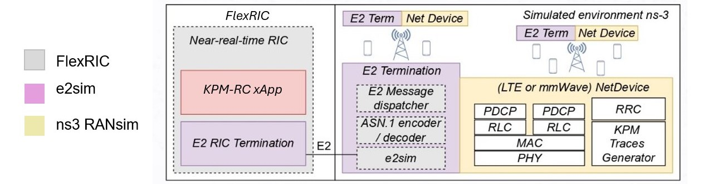
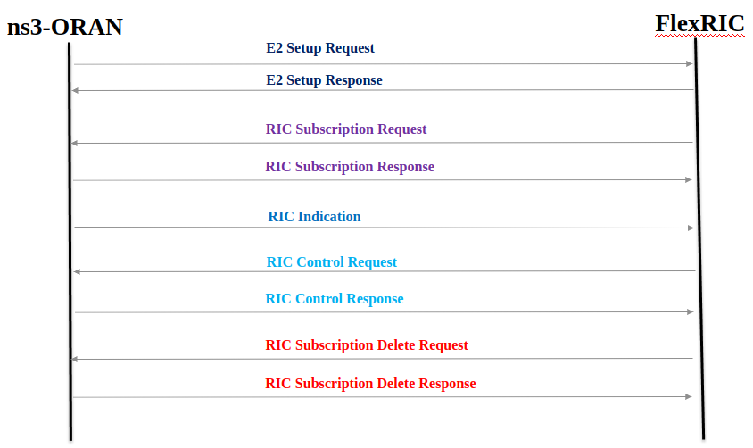

# ns-o-ran-flexric

# Project Introducation

Given the importance of obtaining a capable and fully open-source platform for xApp operation testing,  especially for the complex use-cases. Orange Innovation Egypt(OIE) team Successfully integrated FlexRIC from EURECOM with ns3-oran simulator that originally developed by the institute for the Wireless Internet of Things (WIoT) and Mavenir.  The team updated the ns3-oran simulator to be a fully compliant with E2AP v1.01 and KPM v3. This platform will pave the way to test the use-cases that need a rich LTE/5G simulator to be verified. The original project of ns3-oran in 
[OpenRAN-Gym](https://openrangym.com/tutorials/ns-o-ran).



## Code Structure

The ns-O-RAN is composed by three main components, as shown in the figure below:

-  The [e2sim](https://github.com/wineslab/ns-o-ran-e2-sim) software, which was originally developed by the OSC community. 
-  The [ns3-mmWave](https://github.com/wineslab/ns-o-ran-ns3-mmwave) version, which was originally developed by the University of Padova and NYU.
- The [ns-O-RAN](https://github.com/o-ran-sc/sim-ns3-o-ran-e2) module, developed by Northeastern University and Mavenir, which is basically an external module that can be plugged in ns-3 and uses the e2sim to create a SCTP connection with the RIC.


## Main Updates

### The implemetation of the E2APv1.01 includes:

 1. **E2 Setup request**
 
        - Edit the RAN Function IDs for KPM and RC ​
        - Reformat the size of the message to match FlexRIC (62 byte)​
        - Update the KPM ASN and model to KPM v3 ​
 
 2. **E2 Subscription Response** ​
 
        - Add RAN Function NotAdmitted IE to the message​
        - Update the message to match KPM v3.0​
        - Fill New RIC indication messages formats (Format 3 )​
 
3. **RIC Control Acknoweldege** ​

          -Implemented from scratch
4. **RIC Control Request** ​

          - Update the message to match E2SM RC v1.01​
 
 5. **RIC Subscription delete response**
      
      
        - Implemented from scratch

6. **RIC Subscription modification response (In-Prograss)**

        - Implemented from scratch
7. **RIC Subscription modification confirm (In-Prograss)**

        - Implemented from scratch
      
### The implementation of KPM and RC

1. **Update the KPM ASN and model to KPM v3.00**

2. **Update the RC ASN and model to RC v1.02 (In-Prograss)**

## Requirments

First start with the installation of the prerequisites. In Ubuntu 20.04 LTS, these can be installed with:

```
sudo apt-get update
# Requirements for e2sim
sudo apt-get install -y build-essential git cmake libsctp-dev autoconf automake libtool bison flex libboost-all-dev 
# Requirements for ns-3
sudo apt-get install g++ python3
```

## Installation Instructions

The prepation of enviroment for running testing examples can be done when 'near-RIC' is initialized, as sequence diagram is represented below:


### 1. FlexRiC Installation Instructions

The first release for ns3-oran-flexric proejct is working with a mature commit for flexric, you **must** follow installtion and deployment instructions, under commit number [d3ff879135d036632d7938c2085dbf4577759225](https://gitlab.eurecom.fr/mosaic5g/flexric/-/tree/d3ff879135d036632d7938c2085dbf4577759225) before use the simulator.

### 2. ns3-oran Installation Instructions

First you need to clone the project 

```
git clone --recurse-submodules https://github.com/Orange-OpenSource/ns-O-RAN-flexric
```

**Note**

If you made a clone before and there are new updates so you need to make recursive pull


```
git pull --recurse-submodules https://github.com/Orange-OpenSource/ns-O-RAN-flexric
```

To set up the environment for ORAN E2 simulator, navigate to the `/e2sim` directory. Create a new directory named build. Then execute the script `build_e2sim.sh` with the argument `3` to enable LOG_LEVEL (DEBUG). This is useful to debug the exchange of the messages between the ns-3 and the RIC, but also there are a different debug levels that can be setup. These levels are summarized in the table below.

```
cd e2sim/
mkdir build
./build_e2sim.sh 3
```

<table>
  <thead>
    <tr>
      <th>Log Level e2Sim</th>
      <th>Value</th>
      <th>Description</th>
    </tr>
  </thead>
  <tbody>
    <tr>
      <td>LOG_LEVEL_UNCOND</td>
      <td>0</td>
      <td>Show only the uncoditional logs.</td>
    </tr>
    <tr>
      <td>LOG_LEVEL_ERROR</td>
      <td>1</td>
      <td>Show all the previous logs plus failures on the e2Sim side (such as errors on encoding)</td>
    </tr>
    <tr>
      <td>LOG_LEVEL_INFO</td>
      <td>2  (default)</td>
      <td>Show all the previous logs plus the some info about the size of the messages</td>
    </tr>
    <tr>
      <td>LOG_LEVEL_DEBUG</td>
      <td>3</td>
      <td>Show all the possible logs including the xer_printing of the ASN1.C messages</td>
    </tr>
  </tbody>
</table>

This last command shall configure the cmake project and install the e2sim on the system. Its main actions are also in the aforementioned Dockerfile that we report here to clarify the operations conducted by the script:

```
RUN mkdir /workspace/e2sim/e2sim/build
WORKDIR /workspace/e2sim/e2sim/build # Creation and cd on the build directory
RUN cmake .. -DDEV_PKG=1 -DLOG_LEVEL=${log_level_e2sim} # build of the project with the LOG_LEVEL desired

RUN make package # Creation of the package
RUN echo "Going to install e2sim-dev"
RUN dpkg --install ./e2sim-dev_1.0.0_amd64.deb # Installation of the generated package on the system
RUN ldconfig  # library update to make the package linkable from ns-3 without rebooting the machine
```

Navigate to ns3-mmWave project:

```
cd ns-3-mmwave-oran
```

At this step the software in place to configure and build ns-3:

```
./waf configure --enable-examples --enable-tests
./waf build
```

### Usage/deployment 


#### Scenario Zero
Finally, run an example ns-3 scenario called `Scenario Zero` for testing purpose. This scenario features a Non-StandAlone (NSA) 5G setup in which, its have one LTE eNB positioned in the center of the scenario and four gNBs around it with an inter site distance of 1000 between the eNB and each gNB. You can run the scenario after done the following steps first:
```
1. First you must be done the installation instructions for the flexric mentiond in the above section 'FlexRiC Installation Instructions'
2. Second you must done the building steps for ns3-oran simulator section, to build an 'e2sim' and 'ns-3-mmwave-oran' waf.
3. Navigate to '/path/to/flexric/build/examples/ric/' and then run './nearRT-RIC'.
3. Navigate to '/path/to/flexric/build/examples/xApp/c/kpm_rc' and then run './xapp_kpm_rc'.
4. Navigate to '/path/to/ns-3-mmwave-oran'  and then run './waf --run scratch/scenario-zero.cc'
```

And if everything goes as intended we should be able to see in order the following messages as shown in the diagram below, and flowing between the ns-3 and the RIC, or as mentiond sequence diagram represented above:



1. E2 Setup Request (ns-O-RAN to E2 Term on RIC)
2. E2 Setup Response (E2 Term on RIC to ns-O-RAN)
3. E2 Subscription Request (xApp to ns-O-RAN through E2 Term on RIC)
4. E2 Subscription Response (ns-O-RAN to xApp through E2 Term on RIC)
5. RIC Indication (ns-O-RAN to xApp through E2 Term on RIC)
6. RIC Control Request (xApp to RIC to ns-O-RAN)
7. RIC Control Ack (ns-O-RAN to xApp through E2 Term on RIC)
8. RIC Subscription Delete Request (xApp to RIC to ns-O-RAN)
9. RIC Subscription Delete Response (ns-O-RAN to xApp through E2 Term on RIC)

## Contributers

- [Mina Yonan](https://www.linkedin.com/in/mina-yonan-0989b8b9/), Orange Innovation Egypt, mina.awadallah.ext@orange.com
- [Mostafa Ashraf](https://www.linkedin.com/in/mostafa-ashraf-a62807142/), Orange Innovation Egypt, mostafa.ashraf.ext@orange.com

## Liscence
[GNU GENERAL PUBLIC LICENSE](LICENSE.txt)


