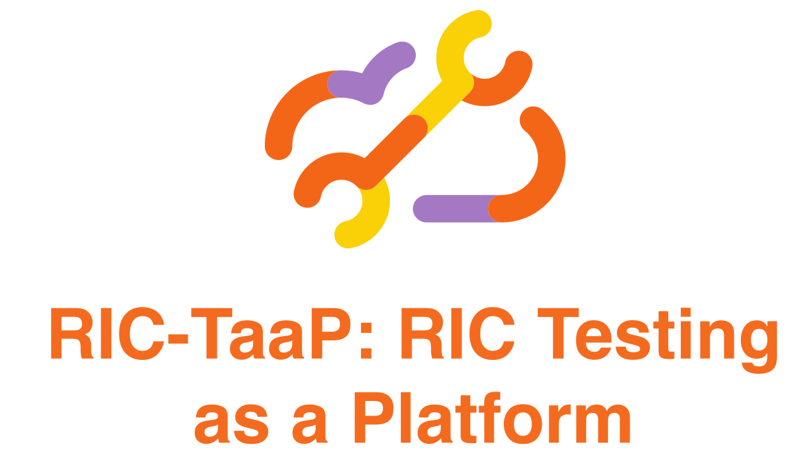
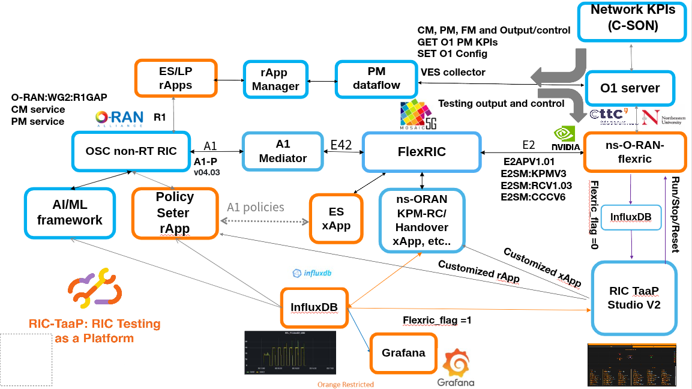
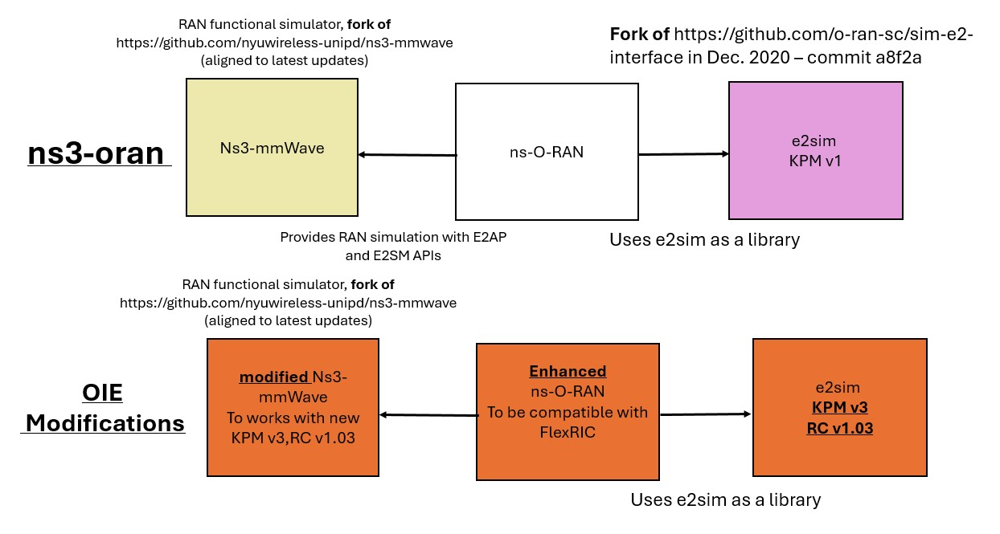
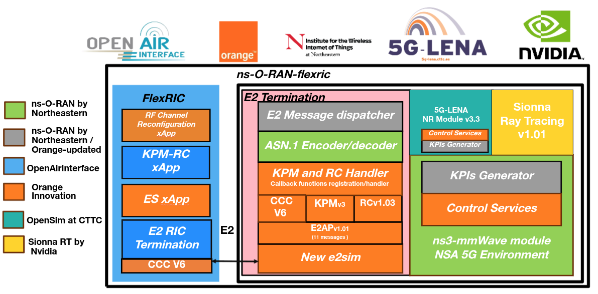
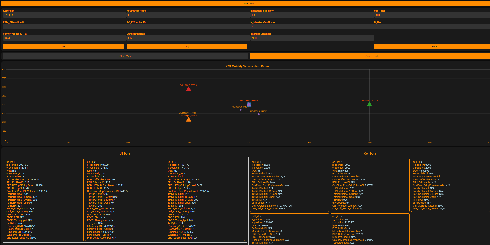
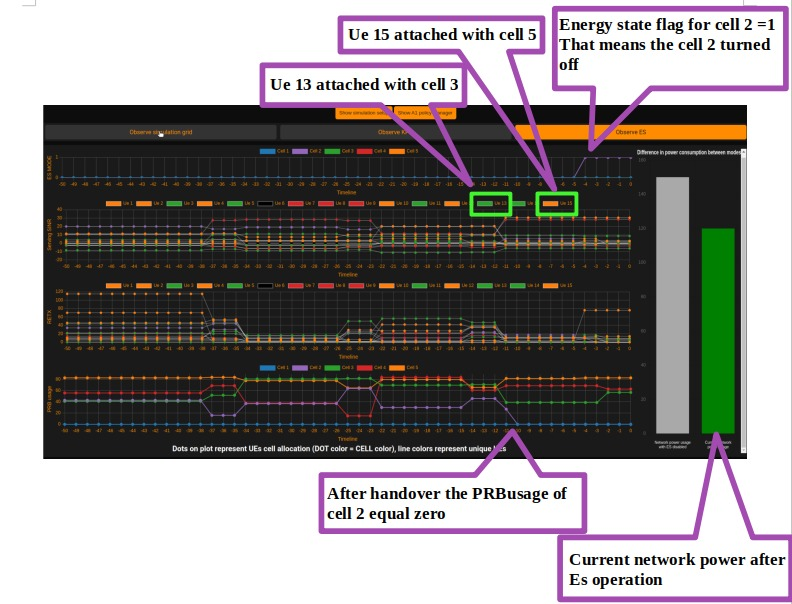
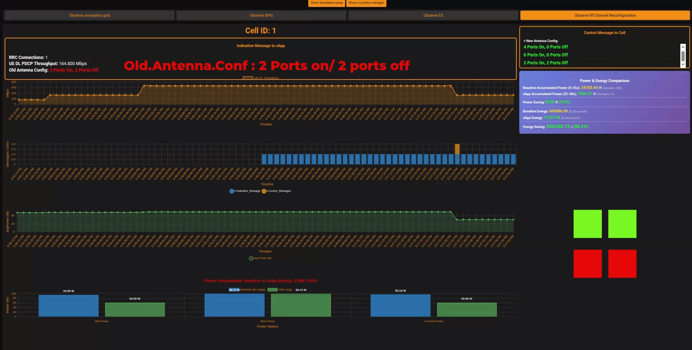
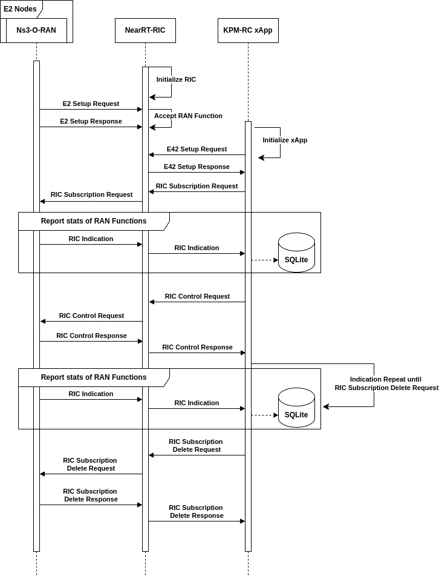
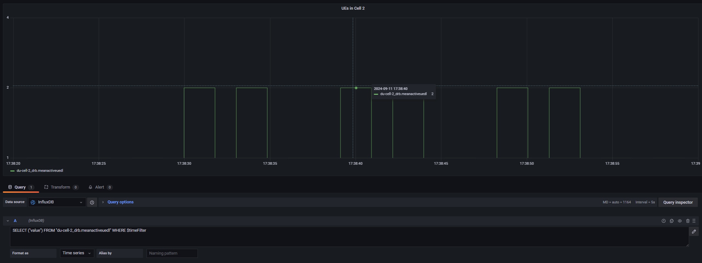
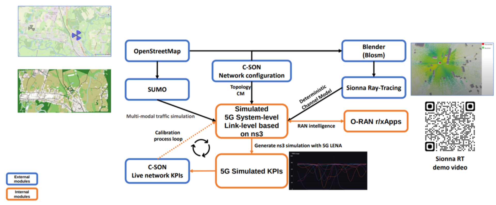

<div align="center">
  <a href="https://github.com/Orange-OpenSource/ns-O-RAN-flexric">
    
  </a>

  <h1>RIC-TaaP — RIC Testing as a Platform</h1>

  <p><em>An open-source 5G simulation platform for xApp and rApp testing,<br/>built on ns-3, FlexRIC, and 5G-LENA.</em></p>

  [](LICENSE.txt)

</div>

---

## Table of Contents

1. [Overview](#1-overview)
2. [Introduction](#2-introduction)
3. [Promo Video](#3-promo-video)
4. [Platform Architecture](#4-platform-architecture)
5. [Capabilities](#5-capabilities)
6. [RIC-TaaP Studio — GUI](#6-ric-taap-studio--gui)
7. [Developed xApps](#7-developed-xapps)
8. [LENA Module Reporting Parameters](#8-lena-module-reporting-parameters)
9. [Installation](#9-installation)
10. [Further Resources](#10-further-resources)
11. [Contributors](#11-contributors)
12. [License](#12-license)

---

## 1. Overview

**ns-O-RAN-flexric** (RIC-TaaP) is an open-source framework for comprehensive testing of xApps and rApps in 5G networks. It integrates five leading open-source simulation components into a unified, O-RAN-compliant platform.

**What the platform provides:**

- A **full 5G system-level simulation** connected to a near-RT RIC (FlexRIC) over the E2 interface.
- A **Digital Twin** environment validated against real operational 5G network KPIs.
- A **web-based GUI** (RIC-TaaP Studio) to run, monitor, and control simulations without command-line interaction.
- **AI/LLM-ready** infrastructure to explore RAN optimization automation.

Developed by **Orange Innovation Egypt (OIE)** in collaboration with **Orange Innovation Poland (OIP)**.

---

## 2. Introduction

RIC-TaaP extends and integrates five leading open-source components to create a complete O-RAN testing environment. The platform achieves full compliance with the following standards:

| Standard | Version |
|----------|:-------:|
| E2AP | v1.01 |
| KPM | v3.00 |
| RC (RAN Control) | v1.03 |
| CCC | v06.00 |

**Integrated open-source components:**

| Component | Origin | Role in Platform |
|-----------|--------|-----------------|
| [e2sim](https://github.com/wineslab/ns-o-ran-e2-sim) | OSC Community | E2 agent — connects ns-3 to the RIC via SCTP |
| [ns3-mmWave](https://github.com/wineslab/ns-o-ran-ns3-mmwave) | Univ. of Padova & NYU | mmWave / LTE PHY and network stack simulation |
| [ns-O-RAN](https://github.com/o-ran-sc/sim-ns3-o-ran-e2) | Northeastern Univ. & Mavenir | O-RAN E2 ns-3 module for message encoding/decoding |
| [5G-LENA NR](https://gitlab.com/cttc-lena/nr) | CTTC OpenSim | 5G NR-compliant PHY/MAC with full KPI tracing |
| [Sionna RT](https://github.com/robpegurri/ns3-rt) | NVIDIA / ns-3 port | GPU-accelerated ray-tracing propagation model |

This project is a collaborative effort between **Orange Innovation Egypt (OIE)** and **Orange Innovation Poland (OIP)**, with OIP providing technical contributions and support.

---

## 3. Promo Video

<div align="center">

[](https://www.youtube.com/watch?v=oN0gBh1E7RE&t)

*Click the image to watch the RIC-TaaP platform demonstration.*

</div>

---

## 4. Platform Architecture

The figure below shows how the five components are composed and how OIE's contributions extend the original ns-O-RAN project:





| Component | Function |
|-----------|----------|
| **e2sim** | Provides the E2 agent that establishes the SCTP connection between ns-3 and the near-RT RIC |
| **ns3-mmWave** | Simulates LTE/mmWave PHY, MAC, RLC, PDCP, and RRC layers |
| **ns-O-RAN module** | Plugs into ns-3 to handle E2AP message encoding and decoding |
| **5G-LENA NR** | Provides a 5G NR-compliant simulation layer with configurable KPI reporting |
| **Sionna RT** | Replaces simplified path-loss models with GPU-accelerated ray tracing for realistic propagation |

---

## 5. Capabilities

### 5.1 What We Integrate

The platform connects all five simulation components to [FlexRIC](https://gitlab.eurecom.fr/mosaic5g/flexric) (EURECOM's near-RT RIC), forming a complete closed-loop E2 interface from the simulated gNB/eNB through to the RIC and xApps.

### 5.2 What We Developed

| Feature | Description |
|---------|-------------|
| **E2AP v1.01 compliance** | Full upgrade of E2 Setup, Subscription, Indication, and Control message handling |
| **KPM v3.00 service model** | Updated ASN.1 model and indication message builder |
| **RC v1.03 service model** | Control Service Style 3 — Handover, Conditional HO, and DAPS HO (Action IDs 1–3) |
| **CCC v06.00 service model** | New Carrier and Channel Configuration service model and handler functions |
| **Cell deep-sleep** | Cell deep-sleep logic for energy-saving use cases |
| **RF Reconfiguration scenario** | ns-3 scenario supporting dynamic antenna port reconfiguration |
| **LENA KPI reporting framework** | Configurable per-layer KPI reporting via `orange-rf-kpi-reporting.cc` |
| **Digital Twin setup** | Hybrid setup combining open-source tools and Orange's C-SON platform |
| **RIC-TaaP Studio (GUI)** | Full web-based GUI for simulation control, KPI visualization, and xApp triggering |
| **Energy Saving xApp** | O-RAN Use Case 21 — cell switch-on/off based on PRB utilization |
| **RF Channel Reconfiguration xApp** | CCC-based antenna port and power reconfiguration xApp |

### 5.3 Implemented from Scratch

The following E2AP message handlers were implemented from scratch to complete E2AP v1.01 compliance:

| Message | Notes |
|---------|-------|
| **RIC Control Acknowledge** | Full implementation |
| **RIC Subscription Delete Request / Response** | Full implementation |
| **RIC Subscription Modification Response** | Full implementation |
| **RIC Subscription Modification Confirm** | Full implementation |
| **RAN Function NotAdmitted IE** | Added to E2 Subscription Response |
| **FORMAT_4_ACTION_DEFINITION** | Added decoding in E2 Subscription Request |

---

## 6. RIC-TaaP Studio — GUI

RIC-TaaP Studio is a web-based interface that makes the platform accessible without requiring deep command-line knowledge. It provides end-to-end control over the simulation and xApp lifecycle.



### Features

| Feature | Description |
|---------|-------------|
| **Simulation Control** | Start / Stop simulations with configurable scenario parameters directly from the browser |
| **Cell & UE Visualization** | Live grid showing cell positions and UE locations |
| **Real-time KPI Dashboard** | KPIs refresh every 1 second, or on each E2 indication when FlexRIC is connected |
| **Energy Saving Dashboard** | QoS KPIs, cell energy state, and power consumption before/after ES xApp execution |
| **RF Reconfiguration Dashboard** | UE DL throughput, average power, indication and control message content |
| **A1 Policy Management** | Set and retrieve A1 policies from the browser |
| **Grafana Integration** | Historical KPI analysis via a pre-deployed Grafana dashboard |

### Access URLs

Once deployed (see [Installation §9.4](#94-gui-deployment)):

| Interface | URL | Credentials |
|-----------|-----|-------------|
| RIC-TaaP Studio | `http://127.0.0.1:8000` | — |
| Grafana | `http://127.0.0.1:3000` | admin / admin |

> **Note:** RIC-TaaP Studio can take up to 5 minutes to fully deploy on first run.

---

## 7. Developed xApps

Two xApps have been developed and validated on the RIC-TaaP platform. Each has a dedicated documentation page covering the concept, operation logic, demo video, and step-by-step instructions for running with or without the GUI.

---

### 7.1 Energy Saving xApp

> **O-RAN Use Case 21** — *Carrier and Cell Switch On/Off* (Sub-use Case 4.21.3.1)

The ES xApp monitors per-cell PRB utilization through KPM indication reports and triggers cell switch-on/off decisions via RC control messages — all without human intervention.

📄 **Full documentation:** [`docs/xapp-energy-saving.md`](docs/xapp-energy-saving.md)  
🎬 **Demo video:** [Watch on YouTube](https://www.youtube.com/watch?v=p5MOp3b8Nm8&t)



---

### 7.2 RF Channel Reconfiguration xApp

> **CCC v06.00** — *Cell Configuration and Control*

The RF Reconfiguration xApp uses the CCC service model to dynamically adjust the number of active antenna ports and transmission power at the gNB in response to observed network conditions.

📄 **Full documentation:** [`docs/xapp-rf-reconfiguration.md`](docs/xapp-rf-reconfiguration.md)

🎬 **Demo video:** [Watch on YouTube] (https://youtu.be/SzBfufGadeI?si=axxVgaDP5hZGRrst)


---

## 8. LENA Module Reporting Parameters

A dedicated reference document maps every reportable KPI to its exact source in the 5G-LENA NR module, and provides a step-by-step guide for enabling custom KPI reporting:

📄 [`docs/LENA_MODEL_REPORTING_PARAMETERS.md`](docs/LENA_MODEL_REPORTING_PARAMETERS.md)

**What it provides:**
- Layer-by-layer KPI catalogue (PHY, MAC, RLC, PDCP, RRC, E2/O-RAN) with implementation status for each parameter.
- The exact file, class, function, and TraceSource for each metric.
- Step-by-step guide using `orange-rf-kpi-reporting.cc` to enable any KPI for custom xApp reporting.

---

## 9. Installation

### 9.1 System Requirements

| Requirement | Specification |
|-------------|--------------|
| Operating System | Ubuntu 20.04 LTS (recommended) |
| RAM | 8 GB minimum |
| Disk Space | 20 GB free |

### 9.2 Required Packages

```bash
sudo apt-get update

# Core build tools and e2sim dependencies
sudo apt-get install -y \
  build-essential git cmake libsctp-dev \
  autoconf automake libtool bison flex libboost-all-dev

# ns-3 dependencies
sudo apt-get install -y g++ python3 libc6-dev

# Optional: SQLite (for LENA comparison examples)
sudo apt-get install -y sqlite sqlite3 libsqlite3-dev

# Optional: Eigen3 (for MIMO features)
sudo apt-get install -y libeigen3-dev

# Docker Compose (for GUI)  →  https://docs.docker.com/compose/install/
```

> **Ubuntu 24.04 note:** Install Python 3.8 inside a virtual environment to avoid breaking system packages:
> ```bash
> sudo add-apt-repository ppa:deadsnakes/ppa && sudo apt update
> sudo apt install python3.8 python3.8-venv python3.8-dev
> python3.8 -m venv myenv && source myenv/bin/activate
> ```

### 9.3 FlexRIC Installation

> This project requires a specific FlexRIC commit. Follow the FlexRIC prerequisites at commit [a358954c](https://gitlab.eurecom.fr/mosaic5g/flexric/-/tree/a358954c12dd009538473dd16554fa62b8835db7), then run:

```bash
git clone https://gitlab.eurecom.fr/mosaic5g/flexric.git && cd flexric
git checkout oie-ric-taap-xapps
mkdir build && cd build
cmake .. -DE2AP_VERSION=E2AP_V1 -DKPM_VERSION=KPM_V3_00
make -j8
sudo make install
```

> **Important:** FlexRIC defaults to E2AP v2.03 / KPM v2.03. The cmake flags above are required to select E2AP v1 and KPM v3.

### 9.4 ns-O-RAN-flexric Installation

**Clone (first time):**
```bash
git clone --recurse-submodules https://github.com/Orange-OpenSource/ns-O-RAN-flexric
```

**Update (existing clone):**
```bash
git pull --recurse-submodules https://github.com/Orange-OpenSource/ns-O-RAN-flexric
```

**Switch branch:**
```bash
git checkout <branch_name> && git submodule update --init --recursive
```

**Build e2sim:**
```bash
cd e2sim-kpmv3/e2sim/
mkdir build
sudo ./build_e2sim.sh 2
```

e2sim log levels:

| Level | Value | Description |
|-------|:-----:|-------------|
| `LOG_LEVEL_UNCOND` | 0 | Unconditional logs only |
| `LOG_LEVEL_ERROR` | 1 | + encoding / decoding errors |
| `LOG_LEVEL_INFO` | 2 *(default)* | + message size information |
| `LOG_LEVEL_DEBUG` | 3 | + full ASN.1 XER printing |

**Build ns-3:**
```bash
cd ../../mmwave-LENA-oran
./ns3 configure
./ns3 build
```

The sequence diagram below shows the initialization flow once the near-RT RIC is running:



### 9.5 GUI Deployment

```bash
cd GUI
# Set NS3_HOST to the IP address of the machine running ns-3
nano docker-compose.yml
docker-compose up --build -d
pip3 install influxdb
```

Open `http://127.0.0.1:8000` in your browser (allow up to 5 minutes on first run).

### 9.6 Running Scenarios

#### Scenario Zero — NSA 5G Baseline

Scenario Zero is a Non-Standalone (NSA) 5G setup with one LTE eNB co-located at the centre and four mmWave gNBs at 1000 m inter-site distance.

1. **Enable KPI logging** — in `example/xApp/c/kpm_rc/`, update the `else` blocks of `log_int_value` and `log_real_value`:
   ```c
   printf("Name = %s, value = %d\n", name.buf, meas_record.int_val);
   printf("Name = %s, value = %d\n", name.buf, meas_record.real_val);
   ```
   Then rebuild: `cd /path/to/flexric/build && make`

2. **Start the RIC:**
   ```bash
   cd /path/to/flexric/build/examples/ric/ && ./nearRT-RIC
   ```

3. **Run the simulation** (via RIC-TaaP Studio or terminal):
   ```bash
   cd /path/to/mmwave-LENA-oran
   ./ns3 run "scratch/scenario-zero-with_parallel_loging.cc \
     --e2TermIp=127.0.0.1 --hoSinrDifference=3 \
     --indicationPeriodicity=0.1 --simTime=1000 \
     --KPM_E2functionID=2 --RC_E2functionID=3 \
     --N_MmWaveEnbNodes=4 --N_Ues=3 \
     --CenterFrequency=3.5e9 --Bandwidth=20e6 \
     --IntersideDistanceUEs=500 --IntersideDistanceCells=600"
   ```

4. **Run the xApp:**
   ```bash
   cd /path/to/flexric/build/examples/xApp/c/kpm_rc && ./xapp_kpm_rc
   ```

> 📹 Expected message exchange: [Wireshark snapshot](https://youtu.be/xD4TbgZ74wY)

#### 5G-LENA Scenarios

To run the KPM-RC xApp with the 5G-LENA module:

1. Use the FlexRIC [dev](https://gitlab.eurecom.fr/mosaic5g/flexric) branch.
2. Start the RIC and open RIC-TaaP Studio (see §9.5).
3. Select `orange-rf-channel-reconfiguration.cc` from the scenario list and start the simulation.
4. Run: `cd /path/to/flexric/build/examples/xApp/c/kpm_rc && ./xapp_kpm_rc`

#### Observe KPIs with Grafana

1. Open `http://127.0.0.1:3000` — log in with **admin / admin**.
2. Go to **Dashboards → Manage** and choose `per_Cell_stats` or `per_UE_stats`.
3. Set the observation time range and enable auto-refresh in the top-right corner.
4. Available KPI query list: [`docs/Grafana KPIs`](docs/)



---

## 10. Further Resources

### 10.1 OAI 10th Anniversary Workshop

| Resource | Link |
|----------|------|
| RIC-TaaP Demo Architecture | [View Figure](fig/8.png) |
| FlexRIC Community Announcement | [GitLab](https://gitlab.eurecom.fr/mosaic5g/flexric/-/tree/dev?ref_type=heads#34--integration-with-ns3-oran-ran-simulator) |
| OAI Demo Brochure | [PDF](https://github.com/Orange-OpenSource/ns-O-RAN-flexric/blob/main/docs/OAI%20Demo%20Workshop%20Data%20Brochure%20v3.pdf) |
| OAI 10th Anniversary Demo | [YouTube](https://youtu.be/PgwKyk8b6K0) |
| KPM-RC xApp Demo | [YouTube](https://www.youtube.com/watch?v=xD4TbgZ74wY) |
| Handover xApp Operation Report | [PDF](docs/handover_operation.pdf) |

### 10.2 Digital Twin Setup

The Digital Twin setup combines open-source tools with Orange's internal C-SON platform to accurately recreate operational environments, enabling automated RAN algorithm testing and performance comparison through Cumulative Distribution Functions (CDFs).



---

## 11. Contributors

| Name | Organisation | Contact |
|------|-------------|---------|
| [Mina Yonan](https://www.linkedin.com/in/mina-yonan-0989b8b9/) | Orange Innovation Egypt | mina.awadallah@orange.com |
| [Mostafa Ashraf](https://www.linkedin.com/in/mostafa-ashraf-a62807142/) | Orange Innovation Egypt | mostafa.ashraf.ext@orange.com |
| [Abdelrhman Soliman](https://www.linkedin.com/in/abdelrahman-khaled-anwer) | Orange Innovation Egypt | abdelrhman.soliman.ext@orange.com |
| [Aya Kamal](http://linkedin.com/in/aya-kamal-elbakly) | Orange Innovation Egypt | aya.kamal.ext@orange.com |
| [Kamil Kociszewski](https://www.linkedin.com/in/kociszz/) | Orange Innovation Poland | kamil.kociszewski@orange.com |
| [Adrian Oziębło](https://www.linkedin.com/in/adrian-ozi%C4%99b%C5%82o-233a32205/) | Orange Innovation Poland | adrian.ozieblo@orange.com |
| [Bartosz Rak](https://www.linkedin.com/in/bartosz-rak-telco/) | Orange Innovation Poland | bartosz.rak@orange.com |
| Andrzej Denisiewicz | Orange Innovation Poland | andrzej.denisiewicz@orange.com |

---

## 12. License

[GNU General Public License](LICENSE.txt)
