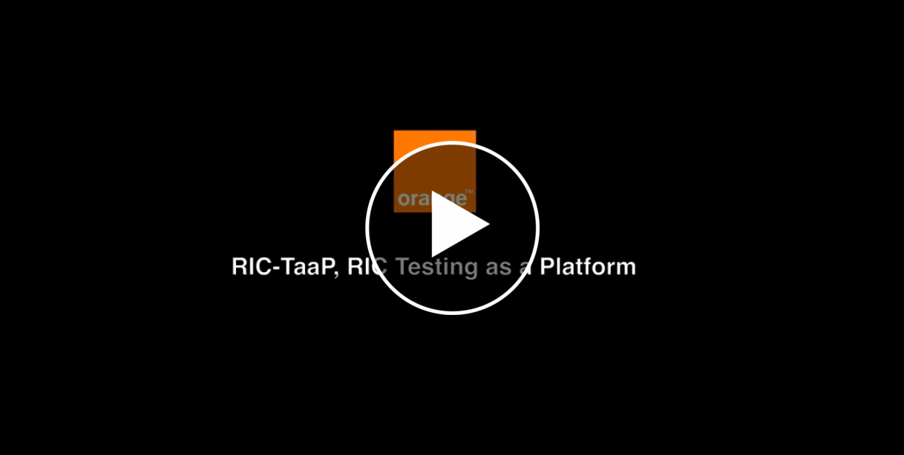

# ns-o-ran-flexric

<div align="center">
<a href="https://github.com/Orange-OpenSource/ns-O-RAN-flexric">
  
</a>
</div>

## Table of Contents

1. [Overview](#1-overview)
2. [Project Introduction](#2-project-introduction)
3. [ns-O-RAN-flexric Code Structure](#3-ns-o-ran-flexric-code-structure)
4. [Sample xApps](#4-sample-xapps)
   - [4.1 Cell Switch On/Off Energy Saving xApp](#41-cell-switch-onoff-energy-saving-xapp)
   - [4.2 RF Channel Reconfiguration xApp](#42-rf-channel-reconfiguration-xapp)
   - [4.3 Custom your xApps](#43-custom-your-xapps)
5. [New ns-3 Features](#5-new-ns-3-features)
6. [RIC-TaaP Studio — GUI](#6-ric-taap-studio--gui)
7. [Digital Twin Setup](#7-digital-twin-setup)
8. [Installation Instructions](#8-installation-instructions)
   - [8.1 FlexRIC Installation Instructions](#81-flexric-installation-instructions)
   - [8.2 ns-O-RAN-flexric Installation Instructions](#82-ns-o-ran-flexric-installation-instructions)
   - [8.3 GUI Deployment](#83-gui-deployment)
   - [8.4 Usage/Deployment](#84-usagedeployment)
9. [Further Resources](#9-further-resources)
10. [Contributors](#10-contributors)
11. [License](#11-license)

---

## 1. Overview

**ns-O-RAN-flexric** is an integral component of the **RIC Testing as a Platform (RIC-TaaP) project** — an open-source framework designed for comprehensive testing of xApps and rApps in 5G networks.

The **RIC-TaaP** project aims to provide:

- **Comprehensive 5G system-level environment for RIC testing**: RIC-TaaP integrates a 5G system-level environment.
- **Proven digital twin testing**: The platform verifies and calibrates various use cases and test scenarios using real KPIs generated from operational 5G environments.
- **User-friendly RIC-TaaP Studio for streamlined testing**: RIC-TaaP includes a graphical user interface (GUI) with multiple dashboards and operational functionalities, facilitating an intuitive testing experience.
- **AI-based innovation**: Study the possible benefits of LLM-powered algorithms and Agentic-AI frameworks to enhance RAN optimization automation and reduce the rigid operational nature of the RAN.


[](https://www.youtube.com/watch?v=oN0gBh1E7RE&t)

---

## 2. Project Introduction

RIC Testing as a Platform (RIC-TaaP) is an open-source initiative designed to streamline xApp/rApp functional and operational testing, foster innovation in xApp/rApp design, and provide proven digital-twin networks.

Recognizing the need for a robust, fully open-source testing ecosystem, Orange Innovation Egypt and Poland (OIE & OIP) have focused on enabling system-level use cases by integrating leading open-source components. This includes:

- [FlexRIC](https://gitlab.eurecom.fr/mosaic5g/flexric) from EURECOM
- The [ns-O-RAN](https://openrangym.com/ran-frameworks/ns-o-ran) simulator, originally developed by the Institute for the Wireless Internet of Things (WIoT), University of Padova, and Mavenir
- The [5G-LENA](https://5g-lena.cttc.es/) module, developed by the [OpenSim](https://www.cttc.cat/open-simulations-opensim/) Research Unit at the [Centre Tecnològic de Telecomunicacions de Catalunya (CTTC)](https://www.cttc.cat/)
- [Sionna Ray Tracing (RT)](https://nvlabs.github.io/sionna/rt/index.html), developed by NVIDIA and translated to ns-3 [here](https://github.com/robpegurri/ns3-rt)

RIC-TaaP extends and integrates these five leading open-source components to create a complete O-RAN testing environment. The platform achieves full compliance with the following standards for the Near-RT RIC control loop, supporting the E2 Application Protocol (E2AP) along with its Service Models (SMs):

| Standard | Version | 5G Simulation Environment |
|----------|:-------:|:--------------------------|
| E2AP     | v1.01   | ns-3-mmwave / LENA-nr V3.3 |
| E2SM-KPM | v3.00   | ns-3-mmwave / LENA-nr V3.3 |
| E2SM-RC  | v1.03   | ns-3-mmwave / LENA-nr V3.3 |
| E2SM-CCC | v06.00  | LENA-nr V3.3               |

This advanced platform facilitates the validation of complex use cases that require a sophisticated LTE/5G simulation environment. The team has also introduced a user-friendly dashboard, **RIC-TaaP Studio**, enabling intuitive test scenario design and a range of operational features — including a GUI for ns-3 that lets users run and observe simulations in an intuitive, user-friendly manner.

The E2 termination for ns-3 modules and the closed-loop control architecture of the Near-RT RIC are shown below:


---

## 3. ns-O-RAN-flexric Code Structure

ns-O-RAN-flexric is composed of five main components, as shown in the figure below:

- [e2sim](https://github.com/wineslab/ns-o-ran-e2-sim), originally developed by the OSC community
- [ns3-mmWave](https://github.com/wineslab/ns-o-ran-ns3-mmwave), originally developed by the University of Padova and NYU
- [ns-O-RAN](https://github.com/o-ran-sc/sim-ns3-o-ran-e2), developed by Northeastern University and Mavenir — an external module that plugs into ns-3 and uses e2sim to create an SCTP connection with the RIC
- The [5G-LENA NR module](https://gitlab.com/cttc-lena/nr), covering SU-MIMO and enhanced PHY/MAC layer capabilities
- The [ns-3 version of Sionna RT](https://github.com/robpegurri/ns3-rt), which enables highly accurate propagation modeling via GPU-accelerated ray tracing — ideal for simulations in complex environments at any frequency, including urban and vehicular scenarios

---

## 4. Sample xApps

Two xApps have been developed and validated on the RIC-TaaP platform. Each has dedicated documentation covering the concept, operation logic, demo video, and step-by-step instructions for running with or without the GUI.

### 4.1 Cell Switch On/Off Energy Saving xApp

> **O-RAN Use Case 21** — *Carrier and Cell Switch On/Off* (Sub-use Case 4.21.3.1)

The ES xApp monitors per-cell PRB utilization through KPM indication reports and triggers cell switch-on/off decisions via RC control messages in a closed-loop fashion.

 [Full documentation](docs/xapp-energy-saving.md) ·  [Demo video](https://www.youtube.com/watch?v=p5MOp3b8Nm8&t)


### 4.2 RF Channel Reconfiguration xApp

> **O-RAN Use Case 21** — *RF Channel Re-configuration* (Sub-use Case 4.21.3.2)

The RF Reconfiguration xApp uses the CCC service model to dynamically adjust the number of active antenna ports and transmission power at the gNB in response to observed network conditions.

 [Full documentation](docs/xapp-rf-reconfiguration.md) · [Demo video](https://youtu.be/SzBfufGadeI?si=axxVgaDP5hZGRrst)


### 4.3 Custom your xApps

A dedicated reference document maps every reportable KPI (76 total) to its exact source in the 5G-LENA NR module, and provides a step-by-step guide for enabling custom KPI reporting: [LENA Model Reporting Parameters](docs/LENA_MODEL_REPORTING_PARAMETERS.md).

**What it provides:**
- A layer-by-layer KPI catalogue (PHY, MAC, RLC, PDCP, RRC, E2/O-RAN) with implementation status for each parameter
- The exact file, class, function, and TraceSource for each metric
- A step-by-step guide using `orange-rf-kpi-reporting.cc` to enable any KPI for custom xApp reporting

**Summary:**

| Layer      | IMPLEMENTABLE | DERIVABLE |  Total |
|------------|:-------------:|:---------:|:-----:|
| PHY        | 24            | 2         |  26    |
| MAC        | 6             | 2         |  8     |
| RLC        | 9             | 2         | 11    |
| PDCP       | 7             | 2         |9     |
| RRC        | 14            | 0         | 14    |
| E2 / O-RAN | 6             | 2         | 8     |
| **Total**  | **66**        | **10**    | **76**|

---

## 5. New ns-3 Features

1. `--E2andLogging=(bool)` — traces KPIs to file and to the E2 termination simultaneously; every "indication period," KPIs are sent to the E2 termination (RIC) and saved to files (CU-CP, CU-UP, DU).
2. New scenario `scenario-zero-with_parallel_loging.cc` — an example using `--E2andLogging=(bool)`.
3. New scenario `orange-rf-kpi-reporting` — helps developers understand what information is available from each layer and how it can be used for monitoring, analytics, and O-RAN xApp development.
4. Cell deep-sleep implementation.
5. Dynamic port power reallocation.
6. **New run flags:**

   ```
   --KPM_E2functionID=(double)
   --RC_E2functionID=(double)
   --N_MmWaveEnbNodes=(uint8_t)
   --N_Ues=(uint32_t)
   --CenterFrequency=(double)
   --Bandwidth=(double)
   --IntersideDistanceUEs=(double)
   --IntersideDistanceCells=(double)
   ```

---

## 6. RIC-TaaP Studio — GUI

RIC-TaaP Studio is a web-based interface that makes the platform accessible without requiring deep command-line knowledge. It provides end-to-end control over the simulation and xApp lifecycle.


### Features

| Feature | Description |
|---------|-------------|
| **Simulation Control** | Start / stop simulations with configurable scenario parameters directly from the browser |
| **Cell & UE Visualization** | Live grid showing cell positions and UE locations |
| **Real-time KPI Dashboard** | KPIs refresh every 1 second, or on each E2 indication when FlexRIC is connected |
| **Energy Saving Dashboard** | QoS KPIs, cell energy state, and power consumption before/after ES xApp execution |
| **RF Reconfiguration Dashboard** | UE DL throughput, average power, indication and control message content |
| **A1 Policy Management** | Set and retrieve A1 policies from the browser |
| **Grafana Integration** | Historical KPI analysis via a pre-deployed Grafana dashboard |

### Access URLs

Once deployed (see [§8.3 GUI Deployment](#83-gui-deployment)):

| Interface       | URL                    | Credentials  |
|-----------------|------------------------|--------------|
| RIC-TaaP Studio | `http://127.0.0.1:8000`| —            |
| Grafana         | `http://127.0.0.1:3000`| admin / admin|

> **Note:** RIC-TaaP Studio can take up to 5 minutes to fully deploy on first run.

---

## 7. Digital Twin Setup

This setup leverages a hybrid of open-source tools and Orange's internal platforms, such as C-SON, to recreate operational environments with high accuracy. The simulation environment supports automated testing of RAN algorithms, enables performance comparison through Cumulative Distribution Functions (CDFs), and drives innovation through safe, rapid experimentation.


---

## 8. Installation Instructions

### System Requirements

- Ubuntu 22.04 LTS (recommended)
- Minimum 8GB RAM
- 20GB free disk space

### Required Packages

```bash
# Update package list
sudo apt-get update

# e2sim requirements
sudo apt-get install -y \
  build-essential \
  git \
  cmake \
  libsctp-dev \
  autoconf \
  automake \
  libtool \
  bison \
  flex \
  libboost-all-dev

# ns-3 requirements
sudo apt-get install -y \
  g++13 \
  python3.8 \
  libc6-dev

# nlohmann JSON (required for the CCC service model)
sudo apt-get install -y nlohmann-json3-dev

# Optional: SQLite (for LENA comparison examples)
sudo apt-get install -y sqlite sqlite3 libsqlite3-dev

# Optional: Eigen3 (for MIMO features)
sudo apt-get install -y libeigen3-dev

# Optional: Docker Compose (for GUI features)
# Follow instructions at: https://docs.docker.com/compose/install/
```

> **Note for Ubuntu 24.04+ users:** installing Python 3.8 directly can break the system Python. Use a virtual environment instead:
>
> ```bash
> sudo add-apt-repository ppa:deadsnakes/ppa
> sudo apt update
> sudo apt install python3.8 python3.8-venv python3.8-dev
>
> python3.8 -m venv myenv
> source myenv/bin/activate
> ```

Environment preparation for running test examples happens once the near-RT RIC is initialized, as shown in the sequence diagram below:


### 8.1 FlexRIC Installation Instructions

You **must** follow the installation and deployment guidelines from the [FlexRIC `oie-ric-taap-xapps` branch](https://gitlab.eurecom.fr/mosaic5g/flexric/-/tree/a358954c12dd009538473dd16554fa62b8835db7) before using the simulator.

Follow the [FlexRIC installation instructions](https://gitlab.eurecom.fr/mosaic5g/flexric/-/tree/a358954c12dd009538473dd16554fa62b8835db7#1-installation). Once you reach [section 2.2](https://gitlab.eurecom.fr/mosaic5g/flexric/-/tree/a358954c12dd009538473dd16554fa62b8835db7#22-build-flexric), note that FlexRIC is configured by default to build the near-RT RIC with **E2AP v2.03** and **KPM v2.03**. The ns-O-RAN simulator instead uses **E2AP v1.01**, **KPM v3.00**, and **CCC v6.00**.

After completing the prerequisites above, run:

```bash
git clone https://gitlab.eurecom.fr/mosaic5g/flexric.git && cd flexric
git checkout oie-ric-taap-xapps
mkdir build && cd build && cmake .. -DE2AP_VERSION=E2AP_V1 -DKPM_VERSION=KPM_V3_00 && make -j8
```

Finally, install the Service Models (SM) on your machine:

```bash
sudo make install
```

### 8.2 ns-O-RAN-flexric Installation Instructions

Clone the project:

```bash
git clone --recurse-submodules https://github.com/Orange-OpenSource/ns-O-RAN-flexric
```

> **Note:** If you cloned before and there are new updates, pull recursively:
>
> ```bash
> git pull --recurse-submodules https://github.com/Orange-OpenSource/ns-O-RAN-flexric
> ```

When checking out any branch, make sure the associated submodule branch is checked out too:

```bash
git checkout <branch_name> && git submodule update --init --recursive
```

Or, to make this automatic going forward:

```bash
git config --global submodule.recurse true
git checkout <branch_name>
```

To set up the environment for the O-RAN E2 simulator:

```bash
cd e2sim-kpmv3/e2sim/
mkdir build
sudo ./build_e2sim.sh 2
```

The final argument to `build_e2sim.sh` sets the log level, useful for debugging message exchange between ns-3 and the RIC:

| Log Level          | Value      | Description |
|---------------------|:----------:|--------------|
| `LOG_LEVEL_UNCOND`  | 0          | Show only unconditional logs |
| `LOG_LEVEL_ERROR`   | 1          | Previous logs, plus failures on the e2sim side (e.g. encoding errors) |
| `LOG_LEVEL_INFO`    | 2 (default)| Previous logs, plus message size info |
| `LOG_LEVEL_DEBUG`   | 3          | All possible logs, including xer-printing of ASN.1 messages |

Navigate to the ns3-mmWave project and build ns-3:

```bash
cd ../../mmwave-LENA-oran
./ns3 configure
./ns3 build
```

### 8.3 GUI Deployment

```bash
cd GUI
nano docker-compose.yml
# Set NS3_HOST to the IP address of the machine running ns-3, e.g.:
#   - NS3_HOST=192.168.100.21
# This is needed so the GUI can control ns-3.

docker-compose up --build -d   # deploys the GUI and an InfluxDB database with the latest images
pip3 install influxdb
```

### 8.4 Usage/Deployment

#### 8.4.1 Run RIC-TaaP Studio

1. Run `python3 gui_trigger.py` in the `mmwave-LENA-oran` folder — this pushes ns-3 KPIs to the database.
2. In your browser, go to `127.0.0.1:8000` or `<NS3_HOST>:8000` (e.g. `127.0.0.1:8000`). First-run deployment can take up to 5 minutes depending on hardware.
3. Start FlexRIC in the background, then click **Connect to FlexRIC** on the webpage.
4. Click **Show form**, choose your run flag values, and click **Start** — cells and UEs should appear on the grid shortly.
   - Select a scenario from the list and click its scenario flags to run that configuration. If scenario flags are disabled, the system uses your custom configuration.
   - Runtime logs from ns-3 are saved to `mmwave-LENA-oran/ns3_run.log`.
5. Click **Source Data** to see current KPIs.
   - If the FlexRIC connection is enabled, GUI KPIs refresh only while an xApp is running and indication messages are being exchanged.
   - If FlexRIC is disabled in the GUI, KPIs refresh every 1 second.
6. To run `scenario-zero-with_parallel_loging` from the GUI: first set the RIC-TaaP parameters as shown [here](docs/RicTaap_prameters1.png), then navigate to `/path/to/flexric/build/examples/xApp/c/orange/` and run `./xapp_kpm_rc_Enhanced`, waiting a few seconds.
7. To stop the simulation, click **Stop** in the **Show Form** window.
8. To close the GUI when it's no longer needed, run `docker-compose down` in the `ns-3-mmwave-oran/GUI` folder.


9. **[Optional]** To view KPIs from past simulations via Grafana, see [§8.4.4](#844-observe-kpis-with-grafana) below.

#### 8.4.2 mmWave Scenarios

Scenario Zero features a Non-Standalone (NSA) 5G setup consisting of one LTE eNB and four gNBs. One gNB is co-located with the LTE eNB at the center; the remaining three are positioned at an inter-site distance of 1000 meters from the center.

To run the scenario:

1. **Enable KPI logging in the xApp.**
   Navigate to `example/xApp/c/kpm_rc/` and open the xApp source file. Locate the functions `log_int_value` and `log_real_value`, and update their `else` blocks as follows:

   ```c
   // In the else block of log_int_value:
   printf("Name = %s, value = %d\n", name.buf, meas_record.int_val);

   // In the else block of log_real_value:
   printf("Name = %s, value = %d\n", name.buf, meas_record.real_val);
   ```

2. **Build FlexRIC:**

   ```bash
   cd /path/to/flexric/build/
   make
   ```

3. **Start the RIC:**

   ```bash
   cd /path/to/flexric/build/examples/ric/
   ./nearRT-RIC
   ```

4. **Run the scenario** — either from RIC-TaaP Studio by selecting `scenario-zero-with_parallel_logging.c`, or from the terminal:

   ```bash
   cd /path/to/mmwave-LENA-oran
   ./ns3 run "scratch/scenario-zero-with_parallel_loging.cc --e2TermIp=127.0.0.1 --hoSinrDifference=3 --indicationPeriodicity=0.1 --simTime=1000 --KPM_E2functionID=2 --RC_E2functionID=3 --N_MmWaveEnbNodes=4 --N_Ues=3 --CenterFrequency=3.5e9 --Bandwidth=20e6 --IntersideDistanceUEs=500 --IntersideDistanceCells=600"
   ```

5. **Run the xApp:**

   ```bash
   cd /path/to/flexric/build/examples/xApp/c/kpm_rc
   ./xapp_kpm_rc
   ```

If everything works, you should see the expected message sequence — see this [Wireshark capture walkthrough](https://youtu.be/xD4TbgZ74wY) for reference.

#### 8.4.3 5G-LENA Module Scenarios

To report any parameter from any protocol layer in the LENA module to a custom xApp:

1. Navigate to `../mmwave-LENA-oran/scratch` and open `orange-rf-kpi-reporting.cc` in your editor. This scenario was created to let users enable reporting flags for any layer they want to report from.
2. In the `NrKpiReportingConfig` object `kpiCfg`, choose the specific KPIs you want to enable. For example:

   ```cpp
   kpiCfg.enablePhyReporting = true;
   kpiCfg.selectedPhyKpis = {
       "PHY.DlDataSinr", "PHY.DlCtrlSinr", "PHY.Rsrp", "PHY.Rsrq",
       // "PHY.Cqi", "PHY.Mcs", "PHY.Ri",
       // "PHY.RxPacketTbSize", "PHY.Tbler", "PHY.CorruptTb",
       // "PHY.PrbUtilizationDl", "PHY.ActivityFactor",
       // "PHY.TxPowerWatts", "PHY.AntennaPortsOn",
       // "PHY.EnergyConsumptionJ", "PHY.InstantaneousPowerW",
       // "PHY.SlotDataUsedSym", "PHY.SlotAvailRb", "PHY.SlotCtrlUsedSym",
   };
   ```

3. Save your edits.
4. Start the RIC:

   ```bash
   cd /path/to/flexric/build/examples/ric/
   ./nearRT-RIC
   ```

5. Run the scenario:

   ```bash
   cd /path/to/mmwave-LENA-oran
   ./ns3 run scratch/orange-rf-kpi-reporting
   ```

6. Run the xApp:

   ```bash
   cd /path/to/flexric/build/examples/xApp/c/orange/
   ./xapp_kpm_rc_Enhanced
   ```

#### 8.4.4 Observe KPIs with Grafana

1. Grafana is deployed together with the GUI via Docker Compose.
2. Access it at `127.0.0.1:3000` or `<NS3_HOST>:3000` in your browser.
3. Default credentials: `admin` / `admin`.
4. Select **Dashboards** in the left sidebar, then click **Manage**.
5. Choose **per_Cell_stats** or **per_UE_stats**.
6. Set the correct observation time period in the top-right corner.
7. Optionally enable auto-refresh, also in the top-right corner.
8. A full list of available KPIs and their queries is in [`/docs/Grafana KPIs`](docs/).


---

## 9. Further Resources

### Participation in the 10th OpenAirInterface Anniversary Workshop

- [RIC Testing as a Platform Demo Architecture](fig/8.png) — full architecture
- [FlexRIC Community Announcement](https://gitlab.eurecom.fr/mosaic5g/flexric/-/tree/dev?ref_type=heads#34--integration-with-ns3-oran-ran-simulator) — GitLab link
- [OAI Demo Brochure](https://github.com/Orange-OpenSource/ns-O-RAN-flexric/blob/main/docs/OAI%20Demo%20Workshop%20Data%20Brochure%20v3.pdf)
- [OAI Demo Video](https://youtu.be/PgwKyk8b6K0) — OpenAirInterface 10th Anniversary Workshop
- [KPM-RC xApp Demo](https://www.youtube.com/watch?v=xD4TbgZ74wY) — YouTube

---

## 10. Contributors

| Name | Organization | Contact |
|------|--------------|---------|
| [Mina Yonan](https://www.linkedin.com/in/mina-yonan-0989b8b9/) | Orange Innovation Egypt | mina.awadallah@orange.com |
| [Mostafa Ashraf](https://www.linkedin.com/in/mostafa-ashraf-a62807142/) | Orange Innovation Egypt | mostafa.ashraf.ext@orange.com |
| [Kamil Kociszewski](https://www.linkedin.com/in/kociszz/) | Orange Innovation Poland | kamil.kociszewski@orange.com |
| [Adrian Oziębło](https://www.linkedin.com/in/adrian-ozi%C4%99b%C5%82o-233a32205/) | Orange Innovation Poland | adrian.ozieblo@orange.com |
| [Abdelrhman Soliman](https://www.linkedin.com/in/abdelrahman-khaled-anwer) | Orange Innovation Egypt | abdelrhman.soliman.ext@orange.com |
| [Aya Kamal](http://linkedin.com/in/aya-kamal-elbakly) | Orange Innovation Egypt | aya.kamal.ext@orange.com |
| [Bartosz Rak](https://www.linkedin.com/in/bartosz-rak-telco/) | Orange Innovation Poland | bartosz.rak@orange.com |
| Andrzej Denisiewicz | Orange Innovation Poland | andrzej.denisiewicz@orange.com |

---

## 11. License

[GNU GENERAL PUBLIC LICENSE](LICENSE.txt)