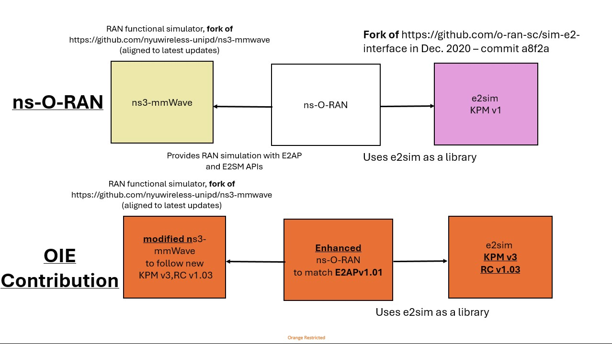
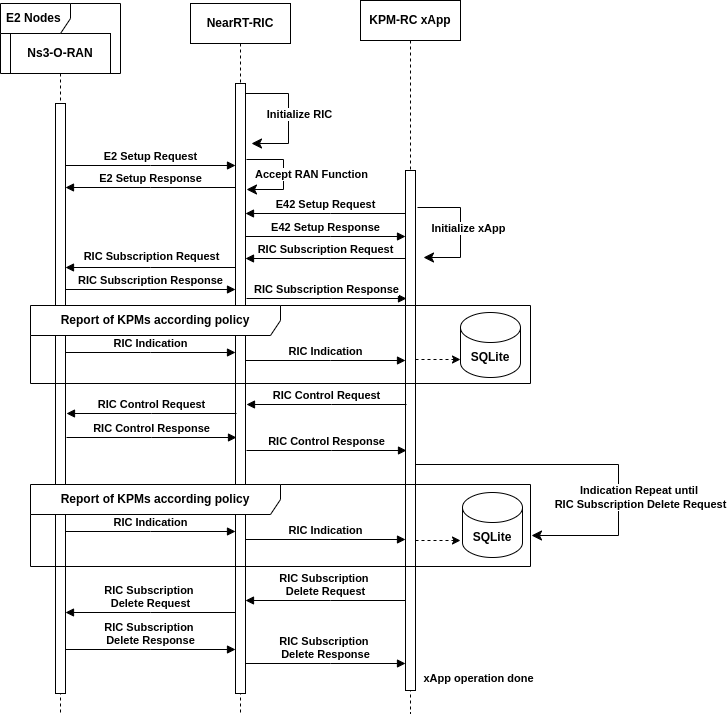

# ns-o-ran-flexric
<div align="center">
<a href="https://github.com/Orange-OpenSource/ns-O-RAN-flexric">
  
</a>
</div>

## 1. Overview:

**ns-O-RAN-flexric** is an integral component of the **RIC Testing as a Platform (RIC-TaaP) project** —an open-source framework designed for comprehensive testing of xApps and rApps in 5G networks.

The **RIC-TaaP** project aims to provide:

- **Comprehensive 5G System-Level Environment for RIC Testing**: RIC-TaaP integrates a 5G system-level environment.

- **Proven Digital Twin Testing**: The platform verifies and calibrates various use cases and test scenarios using real KPIs generated from operational 5G environments.

- **User-Friendly RIC-TaaP Studio for Streamlined Testing**: RIC-TaaP includes a graphical user interface (GUI) that features multiple dashboards and operational functionalities, facilitating an intuitive testing experience.

- **AI-based innovation**: Study the possiable benefits for LLM-powered algorithm and Agentic-AI frameworks to enhance the RAN optimization automation and reduce rigid operational nature of the RAN.

## 2. Project Introduction
 
RIC Testing as a Platform (RIC-TaaP) is an open-source initiative designed to streamline xApp/rApp functional and operational testing, fostering innovation in xApp/rApp design and providing proven digital-twin networks.
Recognizing the need for a robust and fully open-source testing ecosystem, Orange Innovation Egypt (OIE) has focused on enabling system-level use cases by integrating leading open-source components. This includes: FlexRIC from EURECOM, the [ns-O-RAN](https://openrangym.com/ran-frameworks/ns-o-ran) simulator, originally developed by the Institute for the Wireless Internet of Things (WIoT) ,University of Padova and Mavenir , [5G-LENA](https://5g-lena.cttc.es/) module, developed by the [OpenSim](https://www.cttc.cat/open-simulations-opensim/) Research Unit at the [Centre Tecnològic de Telecomunicacions de Catalunya (CTTC)](https://www.cttc.cat/) and [Sionna Ray Tracing (RT)](https://nvlabs.github.io/sionna/rt/index.html) developed by Nvidia and translated to ns-3 [here](https://github.com/robpegurri/ns3-rt).
 

The team upgraded the simulator to achieve full compliance with E2AP v1.01, KPM v3, and RC v1.03 standards. This advanced platform will facilitate the validation of complex use cases that require a sophisticated LTE/5G simulation environment. Additionally, the team has introduced a user-friendly dashboard, RIC-TaaP Studio the platform with a user-friendly dashboard, RIC-TaaP Studio, enabling intuitive test scenario design and incorporating a range of operational features.The development of a Graphical User Interface (GUI) for ns-3, enabling users to execute and observe simulations in an intuitive and user-friendly manner.

This project is a collaborative effort between Orange Innovation Egypt (OIE) and Orange Innovation Poland (OIP), with OIP providing technical contributions and support to the development and enhancement of the platform.


## 2. RIC-TaaP promo video


[](https://www.youtube.com/watch?v=oN0gBh1E7RE&t)

## 3. ns-O-RAN-flexric Code Structure

The ns-O-RAN-flexric is composed by five main components, as shown in the figure below:

- The [e2sim](https://github.com/wineslab/ns-o-ran-e2-sim) software, which was originally developed by the OSC community. 
- The [ns3-mmWave](https://github.com/wineslab/ns-o-ran-ns3-mmwave) version, which was originally developed by the University of Padova and NYU.
- The [ns-O-RAN](https://github.com/o-ran-sc/sim-ns3-o-ran-e2) module, developed by Northeastern University and Mavenir, which is basically an external module that can be plugged in ns-3 and uses the e2sim to create a SCTP connection with the RIC.
- The [5G-LENA NR module](https://gitlab.com/cttc-lena/nr) that covers the SU-MIMO and Enhanced PHY/MAC layer capabilities.
- The [ns3 version of Sionna RT](https://github.com/robpegurri/ns3-rt) Sionna RT enables highly accurate propagation modeling by leveraging GPU-accelerated ray tracing, making it ideal for simulations in complex environments at any frequency, including urban and vehicular scenarios.

The Figure below describes the contribution of OIE over ns-O-RAN project.




## 4. Main Updates

### 4.1 The Implementation of E2APv1.01 includes:

 1. **E2 Setup request**
 
        - Edit the RAN Function IDs for KPM and RC ​
        - Reformat the size of the message to match FlexRIC (62 byte)​
        - Update the KPM description and model to KPMv3 
        - Update the RC description and model to RCv1.03
        - Add STYLE_4_RIC_SERVICE_REPORT 
        - Add STYLE_1_RIC_EVENT_TRIGGER
        - Add FORMAT_1_RIC_EVENT_TRIGGER

 2. **decoding of E2 Subscription Request**

        - Add FORMAT_4_ACTION_DEFINITION decoding


 3. **E2 Subscription Response** ​
 
        - Add RAN Function NotAdmitted IE to the message​

 4. **RIC Indication** ​

        - Update the message to match KPM v3.0​
        - Fill New RIC indication messages formats (Format 3)​
        
5. **RIC Control Request** ​
   
          - Update the message to match E2SM RCv1.03
          - Add CONTROL Service Style 3 (Section 7.6)
          - Add Connected Mode Mobility Managament (Section 7.6.4)
          - Add Control Action ID 1 (Handover Control) (Section 8.4.4.1)
          - Add Control Action ID 2 (Conditional Handover Control) (Section 8.4.4.2)
          - Add Control Action ID 3 (DAPS Handover Control) (Section 8.4.4.3)         

6. **RIC Control Acknowledge** ​

        - Implemented from scratch
7. **RIC Subscription delete request/response**
      
      
        - Implemented from scratch

8. **RIC Subscription modification response**

        - Implemented from scratch
9. **RIC Subscription modification confirm**

        - Implemented from scratch
      
### 4.2 The implementation of KPM and RC

1. Update the KPM ASN and model to KPM v3.00

2. Update the RC ASN and model to RC v1.03

### 4.3 Energy Saving under Cell Utilization (ES) xApp operation 


1. Support for Standardized ES xApp, specifically addressing **Use Case 21** and **Sub-use Case 4.21.3.1**: *Carrier and Cell Switch On/Off* in [O-RAN Use Cases Detailed Specification 15.0](https://specifications.o-ran.org/download?id=712).


2. The logic of the ES xApp is based of observing PRB usage for each cell. The operation sequence of the ES xApp is illustrated in the following diagram: 

3. **Demo Video**  
   - Watch the demonstration: [View Video](https://www.youtube.com/watch?v=p5MOp3b8Nm8&t).  


### 4.4 New ns-3 features

1. '--E2andLogging=(bool)' allows to trace KPIs do file and E2 term in the same time, every "Indication period" KPIs are sent to E2 termination (RIC) and saved to files (CU-CP, CU-UP, DU)
   
2. New scenario "scenario-zero-with_parallel_loging.cc" as example of use '--E2andLogging=(bool)'

3. Cell deep-sleep implementation 


4. **New run flags:**

```
  --KPM_E2functionID=(double)
  --RC_E2functionID=(double)
  --N_MmWaveEnbNodes=(uint8_t)
  --N_Ues=(uint32_t)
  --CenterFrequency=(double)
  --Bandwidth=(double)
  --IntersideDistanceUEs=(double)
  --IntersideDistanceCells=(double)
```

### 4.5 Graphical User Interface (GUI) for ns3

1. Observe Cell/UEs KPIs
3. Run/Stop simulation from GUI with selection of simulation parameters
5. Observe cell allocation and UEs positions
6. Energy Saving Dashboard (Observe QoS KPIs,Energy State and Energy Consumpetion before and after ES xApp execuation)
7. A1 Policy Managment Dashboard (Set and Get for A1 Policies)
9. Grafana platform deployed to observe simulation results

### 4.6 Digital Twin Setup 

This setup leverages a hybrid of open-source tools and Orange’s internal platforms, such as C-SON, to recreate operational environments with high accuracy. The simulation environment will support automated testing of RAN algorithms, enabling performance comparison through Cumulative Distribution Functions (CDFs), and driving innovation through safe and rapid experimentation. 


## 6. Installation Instructions

### System Requirements
- Ubuntu 20.04 LTS (recommended)
- Minimum 8GB RAM
- 20GB free disk space

### Required Packages
Install the following dependencies:

```bash
# Update package list
sudo apt-get update

# E2sim requirements
sudo apt-get install -y \
  build-essential \
  git \
  cmake \
  libsctp-dev \
  autoconf \
  automake \
  libtool \
  bison \
  flex \
  libboost-all-dev

# ns-3 requirements 
sudo apt-get install -y \
  g++13 \
  python3.8 \
  libc6-dev

# Optional dependencies for advanced features
# SQLite (for LENA comparison examples)
sudo apt-get install -y sqlite sqlite3 libsqlite3-dev

# Eigen3 (for MIMO features)
sudo apt-get install -y libeigen3-dev

# Docker Compose (for GUI features)
# Follow instructions at: https://docs.docker.com/compose/install/
```
The prepation of enviroment for running testing examples can be done when 'near-RIC' is initialized, as sequence diagram is represented below:



### 6.1 FlexRIC Installation Instructions

The ns-O-RAN-flexric project is utilizing the latest stable commit of FlexRIC in the **dev** branch. You **MUST** adhere to the installation and deployment guidelines outlined under commit number [a358954c](https://gitlab.eurecom.fr/mosaic5g/flexric/-/tree/a358954c12dd009538473dd16554fa62b8835db7) before use the simulator.

For the FlexRIC [installation instructions](https://gitlab.eurecom.fr/mosaic5g/flexric/-/tree/a358954c12dd009538473dd16554fa62b8835db7#1-installation), once you reach [section 2.2](https://gitlab.eurecom.fr/mosaic5g/flexric/-/tree/a358954c12dd009538473dd16554fa62b8835db7#22-build-flexric), note that FlexRIC is configured to build the nearRT-RIC with **E2AP v2.03** and **KPM v2.03** by default. However, the ns-O-RAN simulator uses **E2AP v1.01** and **KPM v3.00**. After completing the mentioned installation prerequisites, so you should execute the following commands:

```
git clone https://gitlab.eurecom.fr/mosaic5g/flexric.git && cd flexric
```
```
git checkout oie-ric-taap-xapps 
```
```
mkdir build && cd build && cmake .. -DE2AP_VERSION=E2AP_V1 -DKPM_VERSION=KPM_V3_00 && make -j8
```
Finally, to install the Service Models (SM) on your machine, use:
```
sudo make install
```

### 6.2 ns-O-RAN-flexric Installation Instructions

First you need to clone the project 

```
git clone --recurse-submodules https://github.com/Orange-OpenSource/ns-O-RAN-flexric
```

**Note**

If you made a clone before and there are new updates so you need to make recursive pull


```
git pull --recurse-submodules https://github.com/Orange-OpenSource/ns-O-RAN-flexric
```
When checkout to any branch, to ensure you assiocated submodule branch 


```
git checkout <branch_name>   && git submodule update --init --recursive
```

or 

```
git config --global submodule.recurse true
git checkout <branch_name>
```


To set up the environment for ORAN E2 simulator, navigate to the `e2sim-kpmv3/e2sim` directory. Create a new directory named build. Then execute the script `build_e2sim.sh` with the argument `3` to enable LOG_LEVEL (DEBUG). This is useful to debug the exchange of the messages between the ns-3 and the RIC, but also there are a different debug levels that can be setup. These levels are summarized in the table below.

```
cd e2sim-kpmv3/e2sim/
mkdir build
sudo ./build_e2sim.sh 2
```

<table>
  <thead>
    <tr>
      <th>Log Level e2Sim</th>
      <th>Value</th>
      <th>Description</th>
    </tr>
  </thead>
  <tbody>
    <tr>
      <td>LOG_LEVEL_UNCOND</td>
      <td>0</td>
      <td>Show only the uncoditional logs.</td>
    </tr>
    <tr>
      <td>LOG_LEVEL_ERROR</td>
      <td>1</td>
      <td>Show all the previous logs plus failures on the e2Sim side (such as errors on encoding)</td>
    </tr>
    <tr>
      <td>LOG_LEVEL_INFO</td>
      <td>2  (default)</td>
      <td>Show all the previous logs plus the some info about the size of the messages</td>
    </tr>
    <tr>
      <td>LOG_LEVEL_DEBUG</td>
      <td>3</td>
      <td>Show all the possible logs including the xer_printing of the ASN1.C messages</td>
    </tr>
  </tbody>
</table>

Navigate to ns3-mmWave project:

```
cd ../../mmwave-LENA-oran
```

At this step the software in place to configure and build ns-3:
```
./ns3 configure 
./ns3 build
```
### 6.3 GUI deployment

```
cd GUI
nano docker-compose.yml # you need to set 'NS3_HOST' IP which is address of machine where ns3 is deployed '- NS3_HOST=192.168.100.21'. This information is needed for control of ns3 from GUI.
docker-compose up --build -d # this will deploy environement which includes GUI and InfluxDB database with newest images
pip3 install influxdb
```


### 6.4 Usage/deployment 


#### 6.4.1 Run RIC-TaaP Studio
1. First you need to run script 'python3 gui_trigger.py' in 'mmwave-LENA-oran' folder, which will be responsible to push ns3 KPIs to database
2. In your browser, type 127.0.0.1:8000 or 'NS3_HOST':8000 (e.g 127.0.0.1:8000).<br />
 It take up to 5 minutes to deploy portal, depends on HW.
3. Connect to FlexRIC by run Flexric in the bachground and mark on webpage 'Connect to FlexRIC'
4. Click on webpage 'Show form',choose run flags values and click 'Start', you should see Cells and UEs on grid shortly. <br />
 Select the scenario for the scenarion list and click on the sceario flags to run the scenario configuration, if disable scenario flags, the system will you your custom configuration  <br />
 Runtime logs from ns-3 will be saved in 'mmwave-LENA-oran/ns3_run.log' file.
5. To see current KPIs, click 'Source Data'. 
 If FlexRIC connection is enabled, GUI KPIs will refresh only when xApp is running and Indication messages are exchanged. <br />
 If FlexRIC is disabled in GUI, GUI KPIs will refresh every 1s.
6. To run  xapp_rc_handover_ctrl on GUI, at first you need to set the ric taap parameters as show in this figure [Click here to view the RIC TaaP Parameters](docs/RicTaap_prameters1.png) then Navigate to '/path/to/flexric/build/examples/xApp/c/ctrl/ ' .and then run './xapp_rc_handover_ctrl' and wait some seconds.  
7. To stop simulation, click 'Stop' on 'Show Form' window.
8. To close GUI if not needed, please use command 'docker-compose down' in 'ns-3-mmwave-oran/GUI' folder.
   
 

9. **[Optional Step]** If you would like to observe KPIs from Grafana, which allows to observe past simulations, check the next section.

#### 6.4.2 Scenario Zero

Scenario Zero features a Non-StandAlone (NSA) 5G setup consisting of one LTE eNB and four gNBs. One gNB is co-located with the LTE eNB at the center, while the remaining three are positioned at an inter-site distance of 1000 meters from the center. To run the scenario, follow these steps:

1. Enable KPI Logging in the xApp

   To display the reported KPIs in the xApp logs, you need to add print statements:

   - Navigate to `example/xApp/c/kpm_rc/` and open the xApp source file.
   - Locate the two functions: `log_int_value` and `log_real_value`.
   - Modify the `else` blocks in both functions as follows:

   ```c
   // In the else block of log_int_value, replace with:
   printf("Name = %s, value = %d\n", name.buf, meas_record.int_val);
   // In the else block of log_real_value, replace with:
   printf("Name = %s, value = %d\n", name.buf, meas_record.real_val);

2. Navigate to the FlexRIC build directory and compile the code:

   ```c
    cd /path/to/flexric/build/
    make 
3. Start the RIC by running:

   ```c
    cd /path/to/flexric/build/examples/ric/
    ./nearRT-RIC
4. You can Run the scenario from RIC-TaaP studio by selecting ***Scenario-zero-with_parallel_logging.c*** or run it form terminal by navigate to '/path/to/mmwave-LENA-oran'  and then run:
   ```c
    ./ns3 run "scratch/scenario-zero-with_parallel_loging.cc  --e2TermIp=127.0.0.1 --hoSinrDifference=3 --indicationPeriodicity=0.1 --simTime=1000 --KPM_E2functionID=2 --RC_E2functionID=3 --N_MmWaveEnbNodes=4 --N_Ues=3 --CenterFrequency=3.5e9 --Bandwidth=20e6 --IntersideDistanceUEs=500 --IntersideDistanceCells=600 "
5. Navigate to '/path/to/flexric/build/examples/xApp/c/kpm_rc' and then run './xapp_kpm_rc'.
And if everything goes as intended we should be able to see in order the following messages as shown in the Wireshark snapshot [here](https://youtu.be/xD4TbgZ74wY)

#### 6.4.3 Handover xApp operation

The handover xApp enables the initiation of control actions to make handover requests with the following details:

- The handover request is sent to the mmWave cell located in the middle of the scenario.(Note: The handover xApp is a component of the full ES xApp, where the source and target cells are determined based on the KPM indication. Refer to section 4.3 for more details.)
- The Handover xApp initiates handover requests for all UEs associated with the mmWave cell co-located with the LTE node.
- Each UE requires a separate control request.

1. First, you need to switch to [oie-ric-taap-xapps](https://gitlab.eurecom.fr/mosaic5g/flexric/-/tree/oie-ric-taap-xapps?ref_type=heads) branch in Flexric reprocitory.

2. Navigate to '/path/to/flexric/build/examples/ric/' and then run './nearRT-RIC'.
3. Navigate to '/path/to/mmwave-LENA-oran'  and then run './ns3 --run scratch/scenario-three.cc'
4. Navigate to '/path/to/flexric/build/examples/xApp/c/orange/ ' and then run './xapp_rc_handover_ctrl'.
5. To enable running xApp triggering from GUI, please copy two scripts from '/path/to/mmwave-LENA-oran/GUI/FlexRIC xApp GUI trigger' to '/path/to/flexric" and then type "python3 xApp_trigger.py"
6. Use The RIC-TaaP Studio, following Section 6.4.3, Points 1,2,3,4 and 6 or Grafana dashboard to observe the handover operations.
The output of the handover operation is documented and can be reviewed in detail within this [document.](docs/handover_operation.pdf).

#### 6.4.4 Energy Saving under Cell Utilization xApp operation

The ES xApp operation according section 4.3:

1. First, you need to switch to [oie-ric-taap-xapps](https://gitlab.eurecom.fr/mosaic5g/flexric/-/tree/oie-ric-taap-xapps?ref_type=heads) branch in Flexric reprocitory.
2. Navigate to '/path/to/flexric/build/examples/ric/' and then run './nearRT-RIC'.
3. Use The RIC-TaaP Studio, following Section 6.4.3, Points 1,2,3 and 4.
4. Run the ***Energy_saving_with_cell_utilization_scenario.cc*** scenario from RIC-TaaP Studio and select sceanrio flags.
5. Navigate to '/path/to/flexric/build/examples/xApp/c/orange/ ' and then run './xapp_es_with_cell_util'
6. To enable running xApp triggering from GUI, please copy two scripts from '/path/to/ns-3-mmwave-ora/GUI/FlexRIC xApp GUI trigger' to '/path/to/flexric" and then type "python3 xApp_trigger.py"
7. Use The RIC-TaaP Studio, Energy Saving dashboard to observe the xApp operation, QoS parameters and Energy Saving metric [View Video](https://www.youtube.com/watch?v=p5MOp3b8Nm8&t).  


#### 6.4.5 5G-LEAN sceanrios

To run kpm-rc xApp with 5G-LENA module 

1. Swith to flexric [dev](https://gitlab.eurecom.fr/mosaic5g/flexric) branch 
2. Navigate to '/path/to/flexric/build/examples/ric/' and then run './nearRT-RIC'.
3. Use The RIC-TaaP Studio, following Section 6.4.3, Points 1,2,3 and 4.

4. Run the ***orange-rf-channel-reconfiguration.cc*** scenario from RIC-TaaP Studio and select sceario flags.
5. Navigate to '/path/to/flexric/build/examples/xApp/c/kpm_rc ' and then run './xapp_kpm_rc'.
6. To enable running xApp triggering from GUI, please copy two scripts from '/path/to/mmwave-LENA-oran/GUI/FlexRIC xApp GUI trigger' to '/path/to/flexric" and then type "python3 xApp_trigger.py"

#### 6.4.6 Observe KPIs with Grafana
1. Grafana is being deployed together with GUI through Docker Compose.<br />
2. It can be accessed by typing 127.0.0.1:3000 or 'NS3_HOST':3000 in the browser. <br />
3. Default user/password: admin/admin
4. Choose 'Dashboards' on the left sidebar and then click 'Manage'. <br />
5. Here you can choose 'per_Cell_stats' or 'per_UE_stats'. <br />
6. Remember to set correctly observation time period in the right corner of the Grafana. <br />
7. You can also set auto-refresh in the right corner of the Grafana. <br />
8. List of all available KPIs that can be get with query can be found in '/docs/Grafana KPIs'.

 

## 7. Further Resources

### 7.1 Participation in 10th OpenAirInterface Anniversaray Workshop


- **[RIC Testing as a Platform Demo Architecure ](fig/8.png)**: Full Architecture
- **[FlexRIC Community Announcement](https://gitlab.eurecom.fr/mosaic5g/flexric/-/tree/dev?ref_type=heads#34--integration-with-ns3-oran-ran-simulator)**: GitLab Link
- **[OAI Demo Brochure](https://github.com/Orange-OpenSource/ns-O-RAN-flexric/blob/main/docs/OAI%20Demo%20Workshop%20Data%20Brochure%20v3.pdf)**: Link
- **[OAI Demo Video](https://youtu.be/PgwKyk8b6K0)**: OpenAirInterface 10th Anniversary Workshop
- **[KPM-RC xApp Demo](https://www.youtube.com/watch?v=xD4TbgZ74wY)**: YouTube Link 


## 8. Contributers

- [Mina Yonan](https://www.linkedin.com/in/mina-yonan-0989b8b9/), Orange Innovation Egypt, mina.awadallah@orange.com
- [Mostafa Ashraf](https://www.linkedin.com/in/mostafa-ashraf-a62807142/), Orange Innovation Egypt, mostafa.ashraf.ext@orange.com
- [Kamil Kociszewski](https://www.linkedin.com/in/kociszz/), Orange Innovation Poland, kamil.kociszewski@orange.com
- [Adrian Oziębło](https://www.linkedin.com/in/adrian-ozi%C4%99b%C5%82o-233a32205/), Orange Innovation Poland, adrian.ozieblo@orange.com
- [Abdelrhman Soliman](https://www.linkedin.com/in/abdelrahman-khaled-anwer), Orange Innovation Egypt, abdelrhman.soliman.ext@orange.com
- [Aya Kamal](http://linkedin.com/in/aya-kamal-elbakly), Orange Innovation Egypt, aya.kamal.ext@orange.com
- [Bartosz Rak](https://www.linkedin.com/in/bartosz-rak-telco/), Orange Innovation Poland, bartosz.rak@orange.com
- Andrzej Denisiewicz, Orange Innovation Poland, andrzej.denisiewicz@orange.com


## 9. Liscence
[GNU GENERAL PUBLIC LICENSE](LICENSE.txt)


