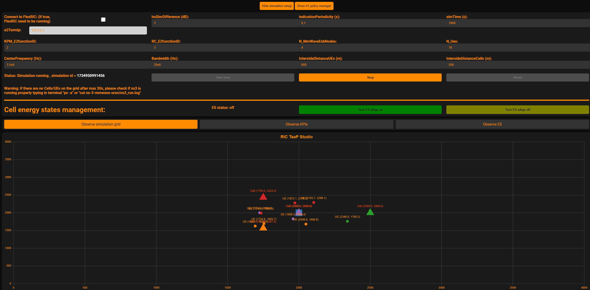
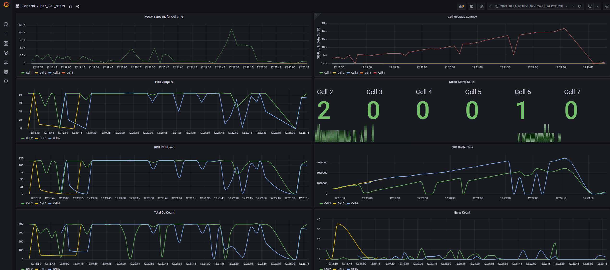

# ns-o-ran-flexric
<div align="center">
<a href="https://github.com/Orange-OpenSource/ns-O-RAN-flexric">
  
</a>
</div>

## 1. Project Introduction

Given the importance of obtaining a capable and fully open-source platform for xApp operation testing,  especially for the complex use-cases. Orange Innovation Egypt(OIE) team Successfully integrated FlexRIC from EURECOM with [ns-O-RAN](https://openrangym.com/ran-frameworks/ns-o-ran) simulator that originally developed by the institute for the Wireless Internet of Things (WIoT) at Northeastren university, university of padova and Mavenir, the ns-O-RAN simulator has been further enhanced by the OIE team.

The team upgraded the simulator to achieve full compliance with E2AP v1.01, KPM v3, and RC v1.03 standards. This advanced platform will facilitate the validation of complex use cases that require a sophisticated LTE/5G simulation environment. Furthermore, we propose the development of a Graphical User Interface (GUI) for ns-3, enabling users to execute and observe simulations in an intuitive and user-friendly manner.


## 2. Project Explanation and Demo

[](https://youtu.be/PgwKyk8b6K0)

## 3. Code Structure

The ns-O-RAN is composed by three main components, as shown in the figure below:

- The [e2sim](https://github.com/wineslab/ns-o-ran-e2-sim) software, which was originally developed by the OSC community. 
- The [ns3-mmWave](https://github.com/wineslab/ns-o-ran-ns3-mmwave) version, which was originally developed by the University of Padova and NYU.
- The [ns-O-RAN](https://github.com/o-ran-sc/sim-ns3-o-ran-e2) module, developed by Northeastern University and Mavenir, which is basically an external module that can be plugged in ns-3 and uses the e2sim to create a SCTP connection with the RIC.


## 4. Main Updates

### 4.1 The implemetation of the E2APv1.01 includes:

 1. **E2 Setup request**
 
        - Edit the RAN Function IDs for KPM and RC ​
        - Reformat the size of the message to match FlexRIC (62 byte)​
        - Update the KPM description and model to KPM v3 
        - Upda​te the RC  description and model to RC v1.03
        - Add RICReportstyle 4
        - Add RICEventTrigger 
 
 2. **E2 Subscription Response** ​
 
        - Add RAN Function NotAdmitted IE to the message​

 3. **RIC Indication** ​

        - Update the message to match KPM v3.0​
        - Fill New RIC indication messages formats (Format 3)​

        
4. **RIC Control Request** ​

          - Add RIC style type 3 
          - Add Connected Mode Mobility Managament (Section 7.6.4)
          - Add Control Action ID 1 (Handover Control) (Section 8.4.4.1)
 
5. **RIC Control Acknoweldege** ​

        - Implemented from scratch
6. **RIC Control Request** ​

        - Update the message to match E2SM RC v1.03
 
 7. **RIC Subscription delete request/response**
      
      
        - Implemented from scratch

8. **RIC Subscription modification response (In-Progress)**

        - Implemented from scratch
9. **RIC Subscription modification confirm (In-Progress)**

        - Implemented from scratch
      
### 4.2 The implementation of KPM and RC

1. Update the KPM ASN and model to KPM v3.00

2. Update the RC ASN and model to RC v1.03

### 4.3 Energy Saving (ES) xApp operation (ongoing)


1. Support for Standardized ES xApp, specifically addressing **Use Case 21** and **Sub-use Case 4.21.3.1**: *Carrier and Cell Switch On/Off* in [O-RAN Use Cases Detailed Specification 15.0](https://specifications.o-ran.org/download?id=712).


2. The operation sequence of the ES xApp is illustrated in the following diagram:


### 4.4 New ns-3 features

1. '--E2andLogging=(bool)' allows to trace KPIs do file and E2 term in the same time, every "Indication period" KPIs are sent to E2 termination (RIC) and saved to files (CU-CP, CU-UP, DU)
   
2. New scenario "scenario-zero-with_parallel_loging.cc" as example of use '--E2andLogging=(bool)'

3. Cell deep-sleep implementation 


4. **New run flags:**

```
  --KPM_E2functionID=(double)
  --RC_E2functionID=(double)
  --N_MmWaveEnbNodes=(uint8_t)
  --N_Ues=(uint32_t)
  --CenterFrequency=(double)
  --Bandwidth=(double)
  --IntersideDistanceUEs=(double)
  --IntersideDistanceCells=(double)
```

### 4.5 Graphical User Interface (GUI) for ns3

1. Observe Cell/UEs KPIs

3. Run simulation from GUI with selection of simulation parameters

4. Stop simulation

5. Observe cell allocation and UEs positions

6. Grafana platform deployed to observe simulation results (in-progress - users need to declare InfluxDB queries themselves)

## 5. Requirments

First start with the installation of the prerequisites. In Ubuntu 20.04 LTS, these can be installed with:

```
sudo apt-get update
# Requirements for e2sim
sudo apt-get install -y build-essential git cmake libsctp-dev autoconf automake libtool bison flex libboost-all-dev 
# Requirements for ns-3
sudo apt-get install g++
sudo apt install python3.13 # (or ealier version, but 3.6+ required)

```
For GUI, Docker Compose is needed, to install it please follow [docs.docker.com](https://docs.docker.com/compose/install/).

## 6. Installation Instructions

The prepation of enviroment for running testing examples can be done when 'near-RIC' is initialized, as sequence diagram is represented below:


### 6.1 FlexRiC Installation Instructions

The ns-O-RAN-flexric project is utilizing the latest stable commit of FlexRIC in the **dev** branch. You **MUST** adhere to the installation and deployment guidelines outlined under commit number [5bca8030](https://gitlab.eurecom.fr/mosaic5g/flexric/-/tree/5bca8030ec551c8d4499cf38357d13e6c98666d3) before use the simulator.

For the FlexRIC [installation instructions](https://gitlab.eurecom.fr/mosaic5g/flexric/-/tree/5bca8030ec551c8d4499cf38357d13e6c98666d3#1-installation), once you reach [section 1.3](https://gitlab.eurecom.fr/mosaic5g/flexric/-/tree/5bca8030ec551c8d4499cf38357d13e6c98666d3#13-clone-the-flexric-project-build-and-install-it), note that FlexRIC is configured to build the nearRT-RIC with **E2AP v2.03** and **KPM v2.03** by default. However, the ns-O-RAN simulator uses **E2AP v1.01** and **KPM v3.00**. After completing the mentioned installation prerequisites, so you should execute the following commands:

```
git clone https://gitlab.eurecom.fr/mosaic5g/flexric.git && cd flexric
```
```
git checkout dev && git checkout 5bca8030
```
```
mkdir build && cd build && cmake .. -DE2AP_VERSION=E2AP_V1 -DKPM_VERSION=KPM_V3_00 && make -j8
```
Finally, to install the Service Models (SM) on your machine, use:
```
sudo make install
```

### 6.2 ns-O-RAN-flexric Installation Instructions

First you need to clone the project 

```
git clone --recurse-submodules https://github.com/Orange-OpenSource/ns-O-RAN-flexric
```

**Note**

If you made a clone before and there are new updates so you need to make recursive pull


```
git pull --recurse-submodules https://github.com/Orange-OpenSource/ns-O-RAN-flexric
```

To set up the environment for ORAN E2 simulator, navigate to the `/e2sim-kpmv3/e2sim` directory. Create a new directory named build. Then execute the script `build_e2sim.sh` with the argument `3` to enable LOG_LEVEL (DEBUG). This is useful to debug the exchange of the messages between the ns-3 and the RIC, but also there are a different debug levels that can be setup. These levels are summarized in the table below.

```
cd /e2sim-kpmv3/e2sim/
mkdir build
sudo ./build_e2sim.sh 3
```

<table>
  <thead>
    <tr>
      <th>Log Level e2Sim</th>
      <th>Value</th>
      <th>Description</th>
    </tr>
  </thead>
  <tbody>
    <tr>
      <td>LOG_LEVEL_UNCOND</td>
      <td>0</td>
      <td>Show only the uncoditional logs.</td>
    </tr>
    <tr>
      <td>LOG_LEVEL_ERROR</td>
      <td>1</td>
      <td>Show all the previous logs plus failures on the e2Sim side (such as errors on encoding)</td>
    </tr>
    <tr>
      <td>LOG_LEVEL_INFO</td>
      <td>2  (default)</td>
      <td>Show all the previous logs plus the some info about the size of the messages</td>
    </tr>
    <tr>
      <td>LOG_LEVEL_DEBUG</td>
      <td>3</td>
      <td>Show all the possible logs including the xer_printing of the ASN1.C messages</td>
    </tr>
  </tbody>
</table>

Navigate to ns3-mmWave project:

```
cd ns-3-mmwave-oran
```

At this step the software in place to configure and build ns-3:

```
./waf configure
./waf build
```
### 6.3 GUI deployment

```
cd ns-3-mmwave-oran/GUI
nano docker-compose.yml # you need to set 'NS3_HOST' IP which is address of machine where ns3 is deployed '- NS3_HOST=192.168.100.21'. This information is needed for control of ns3 from GUI.
docker-compose up --build -d # this will deploy environement which includes GUI and InfluxDB database with newest images
pip3 install influxdb
```


### 6.4 Usage/deployment 


#### 6.4.1 Scenario Zero
Finally, run an example ns-3 scenario called `Scenario Zero` for testing purpose. This scenario features a Non-StandAlone (NSA) 5G setup in which, its have one LTE eNB positioned in the center of the scenario and four gNBs around it with an inter site distance of 1000 between the eNB and each gNB. You can run the scenario after done the following steps first:

1. First you must be done the installation instructions for the flexric mentiond in the above section 'FlexRiC Installation Instructions'
2. Second you must done the building steps for ns3-oran simulator section, to build an 'e2sim' and 'ns-3-mmwave-oran' waf.
3. The last thing, after you done the building process, it's time to run the **scenario-zero** as a first test case.
    1. Navigate to '/path/to/flexric/build/examples/ric/' and then run './nearRT-RIC'.
    2. Navigate to '/path/to/ns-3-mmwave-oran'  and then run './waf --run scratch/scenario-zero.cc'
    3. Navigate to '/path/to/flexric/build/examples/xApp/c/kpm_rc' and then run './xapp_kpm_rc'.


And if everything goes as intended we should be able to see in order the following messages as shown in the Wireshark snapshot below:

[](https://youtu.be/xD4TbgZ74wY)

1. E2 Setup Request (ns-O-RAN to E2 Term on RIC)
2. E2 Setup Response (E2 Term on RIC to ns-O-RAN)
3. E2 Subscription Request (xApp to ns-O-RAN through E2 Term on RIC)
4. E2 Subscription Response (ns-O-RAN to xApp through E2 Term on RIC)
5. RIC Indication (ns-O-RAN to xApp through E2 Term on RIC)
6. RIC Control Request (xApp to RIC to ns-O-RAN)
7. RIC Control Ack (ns-O-RAN to xApp through E2 Term on RIC)
8. RIC Subscription Delete Request (xApp to RIC to ns-O-RAN)
9. RIC Subscription Delete Response (ns-O-RAN to xApp through E2 Term on RIC)

#### 6.4.2 Handover xApp operation

The handover xApp enables the initiation of control actions to make handover requests with the following details:

- The handover request is sent to the mmWave cell located in the middle of the scenario.(Note: The handover xApp is a component of the full ES xApp, where the source and target cells are determined based on the KPM indication. Refer to section 4.3 for more details.)
- The Handover xApp initiates handover requests for all UEs associated with the mmWave cell co-located with the LTE node.
- Each UE requires a separate control request.

1. First, you need to switch to [oie-ric-taap-xapps](https://gitlab.eurecom.fr/mosaic5g/flexric/-/tree/oie-ric-taap-xapps?ref_type=heads) branch in Flexric reprocitory
2. Navigate to '/path/to/flexric/build/examples/ric/' and then run './nearRT-RIC'.
3. Navigate to '/path/to/ns-3-mmwave-oran'  and then run './waf --run scratch/scenario-three.cc'
4. Navigate to '/path/to/flexric/build/examples/xApp/c/ctrl/ ' and then run './xapp_rc_handover_ctrl'.
5. To enable running xApp triggering from GUI, please copy two scripts from '/path/to/ns-3-mmwave-ora/GUI/FlexRIC xApp GUI trigger' to '/path/to/flexric" and then type "python3 xApp_trigger.py"
6. Use The RIC-TaaP Studio, following Section 6.4.3, Points 1,2,3,4 and 6 or Grafana dashboard to observe the handover operations.
The output of the handover operation is documented and can be reviewed in detail within this [document.](docs/handover_operation.pdf) .


#### 6.4.3 Run RIC-TaaP Studio
1. First you need to run script 'python3 gui_trigger.py' in 'ns-3-mmwave-oran' folder, which will be responsible to push ns3 KPIs to database
2. In your browser, type 127.0.0.1:8000 or 'NS3_HOST':8000 (e.g 127.0.0.1:8000).<br />
 It take up to 5 minutes to deploy portal, depends on HW.
3. Connect to FlexRic by run Flexric in the bachground and mark on webpage 'Connect to FlexRIC'
4. Click on webpage 'Show form',choose run flags values and click 'Start', you should see Cells and UEs on grid shortly. <br />
 GUI will run 'scenario-zero-with_parallel_loging.cc' with user defined run flags. <br />
 Runtime logs from ns-3 will be saved in 'ns-3-mmwave-oran/ns3_run.log' file.
5. To see current KPIs, click 'Source Data'. 
 If FlexRIC connection is enabled, GUI KPIs will refresh only when xApp is running and Indication messages are exchanged. <br />
 If FlexRIC is disabled in GUI, GUI KPIs will refresh every 1s.
6. To run  xapp_rc_handover_ctrl on GUI, at first you need to set the ric taap prameters as show in this figure [Click here to view the RIC TaaP Parameters](docs/RicTaap_prameters1.png) then Navigate to '/path/to/flexric/build/examples/xApp/c/ctrl/ ' .and then run './xapp_rc_handover_ctrl' and wait some seconds.  
7. To stop simulation, click 'Stop' on 'Show Form' window.
8. To close GUI if not needed, please use command 'docker-compose down' in 'ns-3-mmwave-oran/GUI' folder.
   
 

9. **[Optional Step]** If you would like to observe KPIs from Grafana, which allows to observe past simulations, check the next section.

#### 6.4.4 Observe KPIs with Grafana
1. Grafana is being deployed together with GUI through Docker Compose.<br />
2. It can be accessed by typing 127.0.0.1:3000 or 'NS3_HOST':3000 in the browser. <br />
3. Dashboards will be shared soon, for test proposes, you can use example query.
4. Click '+' button and choose 'Create Dashboard'.
5. Click 'Add an empty panel'.
6. Click pencil button at the right side of 'FROM' in query builider.
7. Type: 'SELECT ("value") FROM "du-cell-2_drb.meanactiveuedl" WHERE $timeFilter'.
8. Click 'Apply'.
7. Remember to set correct 'Absolute time range' in right corner of Grafana to choose time period when desired simulation started.
8. List of all available KPIs that can be get with query can be found in '/docs/Grafana KPIs'.

 

## 7. Further Resources

### 7.1 Participation in 10th OpenAirInterface Anniversaray Workshop


- **[RIC Testing as a Platform Demo Architecure ](fig/8.png)**: Full Architecture
- **[FlexRIC Community Announcement](https://gitlab.eurecom.fr/mosaic5g/flexric/-/tree/dev?ref_type=heads#34--integration-with-ns3-oran-ran-simulator)**: GitLab Link
- **[OAI Demo Brochure](https://github.com/Orange-OpenSource/ns-O-RAN-flexric/blob/main/docs/OAI%20Demo%20Workshop%20Data%20Brochure%20v3.pdf)**: Link
- **[OAI Demo Video](https://youtu.be/PgwKyk8b6K0)**: OpenAirInterface 10th Anniversary Workshop
- **[KPM-RC xApp Demo](https://www.youtube.com/watch?v=xD4TbgZ74wY)**: YouTube Link 


## 7. Contributers

- [Mina Yonan](https://www.linkedin.com/in/mina-yonan-0989b8b9/), Orange Innovation Egypt, mina.awadallah@orange.com
- [Mostafa Ashraf](https://www.linkedin.com/in/mostafa-ashraf-a62807142/), Orange Innovation Egypt, mostafa.ashraf.ext@orange.com
- [Kamil Kociszewski](https://www.linkedin.com/in/kociszz/), Orange Innovation Poland, kamil.kociszewski@orange.com
- [Adrian Oziębło](https://www.linkedin.com/in/adrian-ozi%C4%99b%C5%82o-233a32205/), Orange Innovation Poland, adrian.ozieblo@orange.com
- [Abdelrhman Soliman](https://www.linkedin.com/in/abdelrahman-khaled-anwer), Orange Innovation Egypt, abdelrhman.soliman.ext@orange.com
- [Aya Kamal](http://linkedin.com/in/aya-kamal-elbakly), Orange Innovation Egypt, aya.kamal.ext@orange.com

## 8. Liscence
[GNU GENERAL PUBLIC LICENSE](LICENSE.txt)


