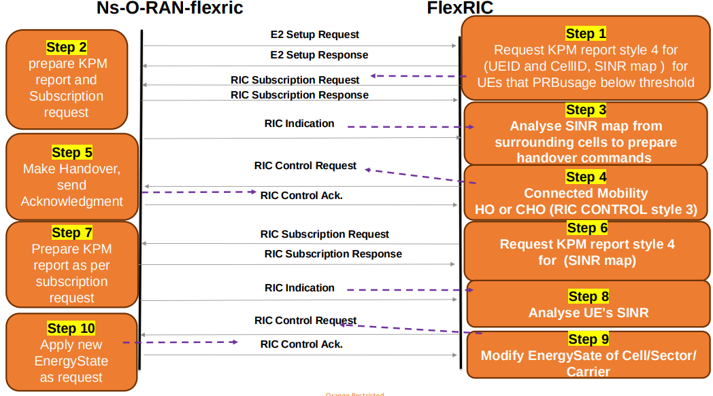

# Energy Saving xApp

## Overview

The Energy Saving (ES) xApp is an O-RAN-compliant near-RT RIC application that automates cell switch-on/off decisions based on real-time radio resource utilization. It closes the loop between the simulated network and the RIC — observing KPM reports, making decisions, and sending RC control messages back to the gNB — entirely autonomously.

| Attribute | Value |
|-----------|-------|
| **O-RAN Standard** | [O-RAN Use Cases Detailed Specification 15.0](https://specifications.o-ran.org/download?id=712) |
| **Use Case** | 21 — *Carrier and Cell Switch On/Off* |
| **Sub-use Case** | 4.21.3.1 |
| **Service Models Used** | KPM v3.00 (reporting), RC v1.03 (control) |
| **Scenario File** | `scratch/Energy_saving_with_cell_utilization_scenario.cc` |
| **xApp Binary** | `xapp_es_with_cell_util` |
| **FlexRIC Branch** | `oie-ric-taap-xapps` |

---

## How It Works

```
┌─────────────────────────────────────────────────────────────────┐
│                         near-RT RIC                             │
│                                                                 │
│   KPM Indication ──► ES xApp ──► Decision ──► RC Control       │
│   (PRB utilization)              (ON / OFF)   (Cell switch)     │
└───────────▲─────────────────────────────────────────┬──────────┘
            │ E2 Interface                             │ E2 Interface
            │                                          ▼
┌───────────────────────────────────────────────────────────────┐
│                     ns-3 Simulation                           │
│                                                               │
│   gNB 1 ── gNB 2 ── gNB 3 ── gNB 4   (mmWave + LTE eNB)    │
│                   UEs                                         │
└───────────────────────────────────────────────────────────────┘
```

**Step-by-step operation:**

1. The ES xApp **subscribes** to KPM indication reports from each simulated gNB.
2. Each report carries the **per-cell PRB utilization** over the indication period.
3. The xApp evaluates per-cell utilization against thresholds:
   - Utilization **below the low threshold** → cell is a candidate to **switch off** (deep sleep).
   - A sleeping cell's neighbours show **high utilization** → cell is a candidate to **switch back on**.
4. The decision is sent as an **RC Control message** (Control Service Style 3, Action ID 1 — Handover Control) to the target gNB.
5. The gNB applies the cell state change and continues reporting.

The sequence diagram below illustrates the full operation:



---

## Demo Video

🎬 [Watch the Energy Saving xApp Demonstration](https://www.youtube.com/watch?v=p5MOp3b8Nm8&t)

---

## Prerequisites

Before running this xApp, make sure the following are in place:

- [ ] FlexRIC built from the [`oie-ric-taap-xapps`](https://gitlab.eurecom.fr/mosaic5g/flexric/-/tree/oie-ric-taap-xapps?ref_type=heads) branch (see [README §9.3](../README.md#93-flexric-installation)).
- [ ] ns-O-RAN-flexric built (see [README §9.4](../README.md#94-ns-o-ran-flexric-installation)).
- [ ] RIC-TaaP Studio deployed (see [README §9.5](../README.md#95-gui-deployment)).

---

## Running with RIC-TaaP Studio (Recommended)


**Step 1 — Start the near-RT RIC**

```bash
cd /path/to/flexric/build/examples/ric/
./nearRT-RIC
```

**Step 2 — Open RIC-TaaP Studio**

Open your browser at `http://127.0.0.1:8000`.

**Step 3 — Connect to FlexRIC**

Click **Connect to FlexRIC** on the homepage to establish the RIC link.

**Step 4 — Select and configure the scenario**

- Click **Show Form**.
- From the scenario list, select `Energy_saving_with_cell_utilization_scenario.cc`.
- Enable the scenario flags to use the preset configuration.
- Click **Start**. Cells and UEs will appear on the grid within a few seconds.

**Step 5 — Launch the ES xApp**

```bash
cd /path/to/flexric/build/examples/xApp/c/orange/
./xapp_es_with_cell_util
```

Alternatively, trigger the xApp directly from the GUI:

```bash
# Copy the trigger scripts (one-time setup)
cp "/path/to/mmwave-LENA-oran/GUI/FlexRIC xApp GUI trigger/"* /path/to/flexric/
cd /path/to/flexric/
python3 xApp_trigger.py
```

**Step 6 — Observe results**

Navigate to the **Energy Saving Dashboard** tab in RIC-TaaP Studio to monitor:

| Metric | Description |
|--------|-------------|
| UE DL Throughput | Per-UE downlink throughput (Mbps) |
| Cell Energy State | Active / Deep-sleep status per cell |
| PRB Utilization | Percentage of PRBs in use per cell |
| Energy Consumption | Power consumption before and after xApp execution |
| QoS Impact | Effect of cell switch-off on user QoS |

**Step 7 — Stop the simulation**

Click **Stop** in the **Show Form** window.

---

## Running from Terminal

Open three separate terminals:

```bash
# Terminal 1 — near-RT RIC
cd /path/to/flexric/build/examples/ric/
./nearRT-RIC
```

```bash
# Terminal 2 — ns-3 simulation
cd /path/to/mmwave-LENA-oran
./ns3 run scratch/Energy_saving_with_cell_utilization_scenario.cc
```

```bash
# Terminal 3 — ES xApp
cd /path/to/flexric/build/examples/xApp/c/orange/
./xapp_es_with_cell_util
```

---

## Key Run Flags

| Flag | Type | Default | Description |
|------|------|---------|-------------|
| `--e2TermIp` | string | `127.0.0.1` | IP address of the near-RT RIC |
| `--KPM_E2functionID` | double | `2` | RAN function ID for KPM service model |
| `--RC_E2functionID` | double | `3` | RAN function ID for RC service model |
| `--indicationPeriodicity` | double | `0.1` | KPM reporting interval (seconds) |
| `--simTime` | double | `1000` | Total simulation duration (seconds) |
| `--N_MmWaveEnbNodes` | uint8 | `4` | Number of mmWave gNBs |
| `--N_Ues` | uint32 | `3` | Number of UEs |
| `--IntersideDistanceCells` | double | `600` | Inter-site distance between cells (metres) |

---

## Related Documentation

- [README — Platform Overview](../README.md)
- [RF Channel Reconfiguration xApp](xapp-rf-reconfiguration.md)
- [LENA Module Reporting Parameters](LENA_MODEL_REPORTING_PARAMETERS.md)
- [Handover xApp Operation Report](handover_operation.pdf)
- [Energy Saving Use Cases (PDF)](Energy_saving_usecases.pdf)
